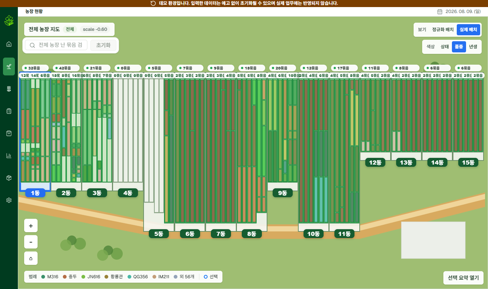

# 난 농장 관리 시스템


비닐하우스 난 농장의 동, 물리 배드, 논리 구역, 난 묶음 데이터를 관리하기 위한 웹 기반 운영 시스템입니다.

2026-07-11 베타 버전을 배포하여 농장에서 활용중이며 [데모 사이트](green-house-demo.sjw-project.site/)를 통해 비식별화된 시스템을 확인할 수 있습니다.

## 구조

```text
green-house/
├─ backend/        Spring Boot, Java 21, JPA
├─ frontend/       Next.js, TypeScript, Tailwind CSS
├─ docs/           요구사항과 설계 문서
└─ docker-compose.yml
```

## 로컬 실행

Windows PowerShell에서는 개발 서버를 한 번에 켜고 끌 수 있습니다.

```powershell
.\scripts\dev-start.ps1
```

접속 주소:

```text
frontend: http://localhost:3000
backend:  http://localhost:8080
```

종료:

```powershell
.\scripts\dev-stop.ps1
```

로그는 `logs/` 디렉터리에 저장됩니다.

### 1. PostgreSQL 실행

```bash
docker compose up -d db
```

기본 DB 접속 정보:

```text
database: greenhouse
username: greenhouse
password: greenhouse
port: 5432
```

DB 스키마는 Flyway가 관리합니다.

```text
backend/src/main/resources/db/migration/
```

새 DB에는 V1부터 순서대로 적용됩니다. 기존 개발 DB는 최초 기동 시 v1 baseline을 등록하고 Hibernate가 엔티티와 스키마를 검증합니다. 엔티티 변경 시 `ddl-auto`를 사용하지 말고 다음 버전의 마이그레이션을 추가해야 합니다.

### 2. 백엔드 실행

```bash
cd backend
./gradlew bootRun
```

Windows PowerShell:

```powershell
cd backend
.\gradlew.bat bootRun
```

백엔드는 기본적으로 `http://localhost:8080`에서 실행됩니다.

초기 실행 시 다음 시드 데이터가 생성됩니다.

- 15개 동
- 45개 물리 배드
- 90개 기본 논리 구역
- 개발 확인용 난 묶음 3개

### 3. 프론트엔드 실행

```bash
cd frontend
npm run dev
```

프론트엔드는 기본적으로 `http://localhost:3000`에서 실행됩니다.

## 현재 범위

- 농장 현황과 난 묶음 배치·이동
- 작업 기록·기간 계획·구조 변경·보정
- 품종·입고·자재 관리
- 판매 전표·A5 출력·경매 lot·정산·입금
- 농장·판매·작업 분석
- 세션 인증, 데모 운영, 주요 운영 데이터 변경 감사

상세 기능은 [기능 요약](docs/03-feature-summary.md), API 요청·응답은
[API 가이드](docs/06-api-guide.md)와 `docs/api/slices/*.openapi.yaml`을 기준으로 확인합니다.

## 검증

백엔드:

```bash
cd backend
./gradlew test
```

프론트엔드:

```bash
cd frontend
npm run check
```