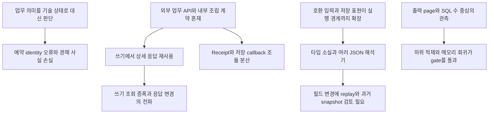

# Backend 최종 평가

> 보관 문서: 당시 코드·감사·검증 이력이며 현재 구현의 기준이 아니다. 미해결/운영 검증/보류 상태는 [현재 작업 목록](../10-remediation-progress.md)을 따른다.

평가일: 2026-10-03. 코드 기준: `80106917232a671b5a489ad8e59d37b63a06dffe`, `develop`.

[01 시스템 지도](01-system-map.md), [02 아키텍처](02-architecture.md), [03 도메인·정합성](03-domain-consistency.md), [04 코드 품질](04-code-quality.md), [05 변경 용이성](05-changeability.md), [06 성능](06-performance.md), [07 테스트](07-testing.md), [08 통합 findings](08-findings.md)를 출발점으로 현재 호출·저장·검증 경계를 다시 대조했다. 01·02·04·05는 이전 revision의 보고서이므로 클래스 수나 과거 Legacy 설명을 현재 상태로 그대로 옮기지 않았다. finding 식별자는 08의 BE ID를 사용한다.

재현 수치는 03·06의 격리된 PostgreSQL/Java 진단 결과다. 이번에는 핵심 코드와 테스트 assertion을 재검토했으며 코드 수정·새 테스트 실행·운영 DB 접속은 하지 않았다. 원인 설명 중 **추론**은 관찰된 코드 관계의 해석이며 작성자의 설계 의도나 과거 장애 원인을 확인했다는 뜻이 아니다.

## 1. Executive summary

**현재 backend는 모듈 소유권과 원자적 저장을 지킬 기반이 있다. 가장 시급한 부채는 판매·경매의 업무 식별자, 상태와 과거 사실의 관계, 조회와 쓰기의 정책 일치다.** 전면 재설계보다 재현된 업무 결함을 먼저 고치는 방향이 타당하다.

08의 44건은 Critical 0, High 5, Medium 27, Low 12다. 이 숫자를 품질 점수로 사용하지 않는다. High 5건은 예약 누락, 경매 이력 삭제, 금액 overflow, 판매불가 재고 예약, 부분 경매/반환 재전송 중복이다. 중요한 부분은 이들이 transaction 부재로 발생한 문제가 아니라는 점이다. 여러 경로는 **잘못된 업무 판단을 원자적으로 저장**한다.

유지보수 비용은 서로 다른 변경 이유가 같은 계약에 얹힌 데서 커진다. Work 실행이 상세 조회 응답을 내부 결과로 사용하고, Farm adapter가 Work 저장 callback·날짜 변경을 조율하며, 실행 타입과 영속 JSON·호환 HTTP 표현이 같은 효과 경계를 통과한다. 필드 하나를 바꿔도 실행·조회·과거 데이터·replay를 함께 검토해야 한다.

| 축 | 최종 판단 | 결정에 주는 의미 |
| --- | --- | --- |
| 모듈 구조 | Entity/Repository 소유권·의존 DAG는 방어됨. 공개 application 범위는 넓음 | 모듈 수를 늘리기보다 승인된 계약과 조율 책임을 좁힘 |
| Domain/transaction | Work·Mutation·입금의 rollback/replay 기반은 유효. Sales·Auction의 업무 의미에 확인된 결함 | P0는 업무 identity·사실 보존·금액·정책 수정 |
| 변경성 | 기존 기록형 작업·납기 정책·집계 조합은 비교적 국소적. 구조 속성·취소·예약 lifecycle은 넓음 | 값 전달/호환 계약을 정한 뒤 단계적으로 변경 |
| Persistence | 여러 GET은 batch/projection으로 방어됨. write/legacy mapper와 child fan-out에는 공백 | SQL 수와 Entity/rows/heap을 함께 관측 |
| 테스트 | 실제 PostgreSQL·실패 주입·동시 요청을 방어함. 업무 sequence 조합을 놓침 | 테스트 수보다 caller identity·연속 변경·관측 경계를 보강 |

권고 순서는 **업무 결함 수정 → 기록·잠금·정책의 일관성 → 확인된 조회 낭비 제거 → 계약 정리와 규모 대응 → 국소 정리**다. 필요한 원장·보상·호환 기능을 제거해 파일 수를 줄이는 작업은 우선순위가 낮다.

## 2. Backend 구조의 강점

| 강점 | 실제 근거 | 유지할 이유와 범위 |
| --- | --- | --- |
| 소유 모듈이 저장을 관리 | ModuleBoundaryInventoryTest의 compiled dependency·query inventory, Work 소유 port/Farm adapter | architecture 검사 범위에서 타 모듈 Entity/Repository 직접 의존 0. Farm·Work가 각 사실을 소유하는 구조를 유지할 수 있음 |
| 단일 DB transaction 안의 모듈 협업 | 최상위 write service, Engine/WorkCommandReceipts/PaymentLedgerService/AuditRecorder의 MANDATORY 참여 | Work 효과·Farm 상태·감사, 판매 출고·snapshot·shipment, 입금·event·balance가 함께 rollback되는 기반 |
| 원장과 직접 쓰기 방어 | Mutation replay·revision·Entry/Relation, V22 ACTIVE write fence | ORM version과 업무 revision을 분리하고 DB 직접 우회를 막음. caller 정책까지 자동으로 보장하는 것은 아님 |
| 시점별 사실 보존 | Work 대상/효과, Sales CREATION/OUTBOUND snapshot, Settlement line 최초 값 | 현재 Entity의 값을 과거 사실로 오인하지 않게 함. 각각 다른 사실의 snapshot임 |
| 조회 전용 값 계약과 일괄 조회 | Farm map projection, Sales 상세 batch, Auction GET assembler, 정산/입금 page, Analytics metrics | 소유권을 유지하면서도 필요한 값만 읽는 선례가 이미 있음 |
| 명시적 실행 확장점 | WorkTypeDefinition·handler/strategy registry, 기동 시 누락/중복 검증 | 기존 workflow 안의 유형 추가를 매 서비스의 문자열 분기로 구현하지 않아도 됨 |
| 실제 DB 회귀와 계약 보호 | PG migration/constraint/lock/rollback 시험, 저장 fingerprint·상세/출력 golden | 변경 시 보존할 경계가 테스트로 드러남. 단순 mock 중심 suite가 아님 |
| 시간과 응답 계약 | 주입 Clock·TimeConfig, 공통 응답/오류, 생성 OpenAPI | 업무일·UTC 저장·클라이언트 타입의 공통 기준이 있음 |

현재 [OrchidGroupMutationEngine](../../backend/src/main/java/com/greenhouse/backend/farm/application/orchid/mutation/OrchidGroupMutationEngine.java), [BusinessPartnerLock](../../backend/src/main/java/com/greenhouse/backend/partner/application/BusinessPartnerLock.java), [PaymentLedgerService](../../backend/src/main/java/com/greenhouse/backend/settlement/application/PaymentLedgerService.java)의 caller transaction 계약을 다시 확인했다. 모듈 간 port·값 계약이 실제로 사용되므로 이 구조를 이름뿐인 계층화로 평가하지 않는다.

## 3. 가장 위험한 문제

### 3.1 업무 의미를 기술 상태로 대신한 결함

| 문제 | 재현된 결과 | 원인과 증폭 관계 |
| --- | --- | --- |
| BE-001 예약 identity | spec만 수정했는데 allocation 10·reserved 0·reserve movement 2 | JPA root version을 신규 업무 identity로 사용. Engine은 기존 key를 올바르게 replay하지만 Sales는 이를 새 예약 사실로 기록 |
| BE-002 경매 이력 삭제 | SOLD 결과→수동 WAITING→미정산 전표 취소 후 result/attempt/history 삭제 | 현재 상태를 과거 결과 존재로 간주. 같은 근거의 capability·실행 판단은 둘 다 같은 오류를 공유 |
| BE-003 금액 overflow | 2×1,500,000,000원이 음수 total로 저장되고 예약도 확정 | 입력 필드별 validation을 계산 결과의 범위 보장으로 간주. 미수금/입금 모델에 잘못된 총액을 전달 |
| BE-004 판매 상태 불일치 | 병해충 그룹에 판매 10개 예약 확정 | 집계의 판매불가 정책이 searchSellable/reserve에 연결되지 않음. 조회상 의미와 실제 writer가 분리 |
| BE-005 재전송 중복 | 자동 차수 부분 낙찰 10개 두 번으로 sold 20; Java 부분 반환 두 번도 누적 | row lock·차수 UNIQUE를 요청 dedup으로 간주. 자동 차수는 재시도마다 새 identity를 만들고 반환은 key가 없음 |

[SalesSlipInventoryService.reserve/recordMovements](../../backend/src/main/java/com/greenhouse/backend/sales/application/SalesSlipInventoryService.java), [SalesSlipUpdateService.update](../../backend/src/main/java/com/greenhouse/backend/sales/application/SalesSlipUpdateService.java), [AuctionShipmentLifecycleService](../../backend/src/main/java/com/greenhouse/backend/auction/application/AuctionShipmentLifecycleService.java), [AuctionShipmentLot](../../backend/src/main/java/com/greenhouse/backend/auction/domain/AuctionShipmentLot.java), [SalesSlipItem](../../backend/src/main/java/com/greenhouse/backend/sales/domain/SalesSlipItem.java)의 해당 판단이 현재 코드에도 남아 있다.

BE-001은 Engine을 고치거나 `saveAndFlush`를 더 호출하는 것으로 해결되지 않는다. 신규 업무를 고유하게 표현하는 책임은 Sales caller에 있다. BE-002도 상태 enum을 바꾸는 것만으로 해결되지 않는다. 과거 결과가 존재하는 출하의 취소·삭제 가능성을 실제 참조와 보존 정책으로 판단해야 한다.

### 3.2 동일 원인이 다른 결함으로 이어지는 지점

BE-002와 BE-007은 **현재 상태와 변경 사실을 충분히 구분하지 않은 모델**로 연결된다. `changeStatus`는 상태가 같으면 기록하지 않으므로 같은 상태의 수량 보정은 이력이 없다. 결과가 있는 lot를 WAITING으로 바꿀 수 있으므로 상태 기반 삭제 guard도 무너진다. 상태 전이 제한과 별도의 수량 변경 기록을 함께 다뤄야 한다. 정산 snapshot을 현재 lot 값으로 덮어쓰는 방식은 과거 금액 보존을 깨뜨린다.

BE-001과 BE-006은 같은 release→replace→reserve 유스케이스에서 발생하지만 원인은 다르다. 전자는 identity, 후자는 transaction 전체의 누적 lock 순서다. **identity 수정은 deadlock 수정을 대신하지 않는다.** 실제 PG 교착은 확인됐고 rollback도 작동했으므로 BE-006은 Medium을 유지한다. group/zone 순서가 반대인 다른 경로는 아직 정적 위험이다.

운영 DB의 위반 건수·피해 규모는 조사하지 않았다. P0는 신규 잘못된 저장을 막는 개선 우선순위이며 현재 광범위한 운영 장애가 발생했다는 선언은 아니다. 이미 사라진 경매 이력은 코드 수정만으로 복구되지 않고 별도 보존 자료가 필요하다.

## 4. 가장 큰 유지보수 비용

### 4.1 원인 관계

이 그림은 직접 코드로 연결되는 영향과 시험의 탐지 한계를 함께 표시한다. 테스트 공백이 production 결함의 발생 원인이라는 의미는 아니다. 결함의 원인과 결함이 발견되지 않은 이유를 구별해야 한다.

### 4.2 가장 비싼 변경은 구조 결과 속성의 수명 전체다

새 속성은 입력·상속·MutationDetails·현재 Entity뿐 아니라 효과 JSON, 원장 snapshot/canonical, 감사 changedFields, 상세/그래프, 필요 시 판매 snapshot까지 이동한다. **서로 다른 과거 사실을 저장하는 복사**와 **의미 없는 중간 DTO 복사**가 같은 변경 목록에 섞인다. 전자는 필요하고 후자는 줄일 수 있다(BE-012/013/016).

특히 `OrchidGroupMutationFingerprint`와 `WorkRequestFingerprint`는 객체 직렬화를 정규화한다. 새 nullable 필드도 hash를 바꿀 수 있다. snapshot의 absent/null/default 의미는 원장 head·대사·취소 복원에 영향을 준다. 타입을 잘 정리해도 이 영속 호환 비용은 사라지지 않는다. 기존 JSON/hash를 보존하는 정책을 먼저 정해야 타입 정리가 안전하다.

### 4.3 중복의 원인은 모두 module boundary가 아니다

| 중복·분산 | 원인 판정 | 적절한 개선 |
| --- | --- | --- |
| Farm 상태·Work 효과·Sales 출고·Settlement 금액 snapshot | 다른 시점·다른 업무 사실. 모듈 소유권이 요구하는 유효한 중복 | 사실별 시점/필드 의미를 명시하고 같은 transaction 유지 |
| 생성/수정의 직접 판매 거래처 validation | 같은 Sales 모듈 안의 공통 정책 재사용 부족(BE-023) | 작은 정책 공유. 모듈 재분할 불필요 |
| 판매불가 집계와 예약 허용 조건 | 정책의 조회/명령 연결 부족(BE-004) | Farm의 승인된 예약 정책을 writer·조회 계약에 연결 |
| 결과 계획→CreateRequest→MutationDetails | HTTP 생성 DTO의 내부 경유(BE-016) | 기존 내부 계획에서 필요한 값 직접 보유 |
| JSON key를 아는 상세/target/계보 reader | 저장/호환 표현이 실행·조회 여러 경계에 노출(BE-012) | 형식별 호환 decoder와 typed 현재 결과를 구분 |
| 모듈 API를 거친 상세 응답 반복 조회 | 내부 상태 전환과 최종 응답의 계약 혼재(BE-015) | 좁은 내부 결과, 최종 조립 한 번 |
| 거래처 전체 ID 검색·큰 IN | 모듈 소유권을 지키는 현재 검색 계약의 규모 한계(BE-032) | 소유 모듈 안의 검색/bulk 계약 개선과 plan 실측 |

모듈 경계가 마지막 두 경로의 호출 수에 영향을 주지만 경계를 제거해야 한다는 결론은 나오지 않는다. 이미 batch/projection으로 같은 소유권을 지키는 GET이 존재한다. 외부 Native SQL join으로 해결하면 성능 문제를 소유권·변경 결합 문제로 옮길 수 있다.

### 4.4 보정의 저장 책임과 실행 순서가 분리되어 있다

[WorkOperationCorrectionService](../../backend/src/main/java/com/greenhouse/backend/work/application/correction/WorkOperationCorrectionService.java)는 감사 Entity와 루트 transaction을 소유한다. [FarmWorkCorrectionAdapter](../../backend/src/main/java/com/greenhouse/backend/farm/application/transformation/FarmWorkCorrectionAdapter.java)는 저장 callback을 호출하고 Work 날짜를 바꾼다. BE-020의 비용은 단순 모듈 왕복이 아니라 **소유자는 Work인데 일부 실행 순서는 Farm이 결정하는 구조**다. Receipt scope/membership을 Farm에서 선택하는 BE-021과 같은 공개 계약 문제로 연결된다.

Work가 감사 ID·날짜·최종 조립을 조율하고 Farm이 농장 판단/변경 결과를 돌려주는 방향이 적절하다. callback만 별도 service로 포장하면 숨은 순서를 그대로 남긴다. 검증과 쓰기를 다른 transaction으로 분리하면 race를 새로 만든다.

## 5. 가장 큰 코드 품질 문제

### 5.1 값의 표현은 있는데 업무 identity·사실의 의미가 부족하다

Sales에는 전표 version·재고 movement·Mutation source가 있고 Auction에는 lot status·attempt·result·history가 있다. 필요한 저장 구조가 없어서만 생긴 결함은 아니다. **어느 값이 신규 업무를 식별하고 어느 기록이 취소 가능성의 근거인지 application 계약이 충분히 명시하지 못한다.** 그 결과 기술적으로 유효한 상태를 업무적으로 올바른 상태로 오인한다(BE-001/002/005/007).

금액도 독립적인 품질 문제다. [SalesSlip.recalculateAmounts](../../backend/src/main/java/com/greenhouse/backend/sales/domain/SalesSlip.java)는 int sum 뒤 remaining을 0 이상으로 clamp한다. 곱/합계 overflow를 거절하는 정책이 없으므로 clamp가 잘못된 금액을 정상적인 미수금처럼 보이게 한다. 문자열 정리나 exception 통일보다 이 domain 연산을 먼저 수정해야 한다.

### 5.2 타입이 보장하는 구간이 짧다

typed 구조 명령/결과가 있어도 [WorkEffectCommand](../../backend/src/main/java/com/greenhouse/backend/work/application/effect/WorkEffectCommand.java)는 Object/Map으로 받고 handler가 런타임에 복원한다. 저장 표현을 바꾸면 compiler가 모든 reader를 찾아주지 않는다. 실행 중 타입 소실, 여러 decoder의 fallback 차이, hash 호환이 결합해 코드 리뷰 범위를 크게 만든다(BE-012/013).

이 문제를 모든 handler의 generic hierarchy나 새 공통 command framework로 풀 필요는 없다. 기존 typed command/result를 어디까지 유지할지와 어디서 JSON으로 변환할지를 먼저 좁히는 것이 효과적이다.

### 5.3 서비스 복잡도는 필요한 조율과 혼합된 책임의 합이다

[WorkOperationVoidService.inspectCancellation](../../backend/src/main/java/com/greenhouse/backend/work/application/operation/WorkOperationVoidService.java)는 상태별 blocker, 연관 폐기, 효과/Mutation, 기록형/포트/구조 변경, lock 모드, 영향 응답을 처리한다. 취소 가능 여부·보상·동시 재검증이 필요한 이유는 도메인에 있다. 한 지역 상태에서 판단과 표현을 함께 누적하는 비용은 줄일 수 있다(BE-017).

따라서 이 service 전체를 domain modeling 부재로 판정하지 않는다. **Auction의 사실/상태 구분과 Sales의 operation identity는 모델 의미를 보완해야 하는 문제이고, Work 취소는 이미 존재하는 정책·결과의 조립 경계를 정리할 문제**다. 둘을 같은 대규모 service 분할로 해결하면 중요한 실행 순서가 더 숨을 수 있다.

BE-018의 위치 기반 graph 생성, BE-024의 호출되지 않는 옵션, BE-025의 명령 재분해는 확인된 국소 비용이다. 다만 현재 재고/금액 오류보다 우선하지 않는다. Reader/Resolver/Adapter suffix나 클래스 길이 자체는 가장 큰 품질 문제의 근거가 아니다.

## 6. 과잉 추상화

과잉은 계층 수보다 **다른 호출자가 알아야 하는 내부 메커니즘**으로 평가한다.

| 축소할 경계 | 과잉인 이유 | 줄이는 방법 |
| --- | --- | --- |
| Farm에서 사용하는 Work Receipt scope/Object/callback | 업무 취소 API의 소비자가 접수 저장·membership 구분까지 선택(BE-021) | typed 업무 계약으로 scope/지문/저장 선택을 Work 안에 둠 |
| Work 보정 port의 Supplier 저장 callback | Farm adapter가 Work 감사 저장 시점을 제어(BE-020) | 상위 Work가 ID·날짜·최종 결과를 조율 |
| 공통 effect의 Object/Map | 확장 가능한 interface지만 타입·호환·persistence 지식이 실행기에 전파(BE-012) | 현재 typed 경로와 호환 표현 변환을 구분 |
| 중간 CreateRequest·상세 WorkOperationView | 내부 결과보다 넓은 계약을 만든 뒤 필요한 값만 다시 꺼냄(BE-015/016) | 기존 내부 계획/결과로 필요한 값 전달 |
| requiresEverySourceResult 옵션 | override가 있어도 실행에서 사용되지 않음(BE-024) | 제거 또는 실제 정책 변경으로 연결·시험 |

**과거 migration·호환성이 일부 추상화 폭을 설명하지만 모든 폭을 정당화하지는 않는다.** [LegacyStructureChangeRequestMapper](../../backend/src/main/java/com/greenhouse/backend/farm/application/transformation/LegacyStructureChangeRequestMapper.java)의 과거 입력 변환과 단일-source 호환 결과는 실제 소비자를 지원한다. 반면 정상 신규 포트 실행에서도 typed→Map→요청 DTO로 왕복한다. 과거 입력의 변환을 입구에 유지해도 신규 실행 전체에서 타입을 잃을 필요는 없다. 이 구분은 현재 호출 코드에 근거한 추론이며 migration이 모든 복잡성을 만들었다는 역사적 판정은 아니다.

handler/strategy registry·사용 검사 port·AuditRecorder·Mutation recorder/replay/effective-head 분리는 실제 정책/저장 책임을 가진다. 작은 클래스라는 이유로 wrapper로 합치지 않는다. 공통 멱등 프레임워크·모든 서비스 interface화·별도 Mutation 모듈은 현 단계의 필수 개선이 아니다.

## 7. 필요한 복잡성

| 필요한 복잡성 | 제거하면 생기는 문제 | 개선 가능한 경계 |
| --- | --- | --- |
| N:M 구조 변경의 source/result/속성 상속·수량 수지 | 분주·합식·부분 처리의 사실을 단일 CRUD로 표현 못함 | 실행 계획의 중간 DTO만 줄이고 source 변경 전 값 확보 유지 |
| 예약·출고·취소 복구 분리 | 작성중 전표가 실재고를 차감하거나 취소가 잘못 복구됨 | 업무 identity·전체 잠금 계획을 명시하되 lifecycle 유지 |
| Work와 Farm 원장의 별도 기록 | 작업 실행의 의미와 재고 상태 revision이 뒤섞임 | Mutation/correlation 연결과 동일 transaction 유지 |
| effective head·후속 사용·실사 검사·보상 취소 | 이미 사용된 결과나 실사 이후 상태를 과거 취소가 덮음 | blocker 계산/표현 분리. guard와 잠금 후 재검증 유지 |
| 잠금 전후 replay와 READ COMMITTED 재확인 | 잠금 대기 중 상대 transaction commit을 놓침 | 조회 횟수 최적화 때 각 조회의 시점 의미 확인 |
| 생성/출고/정산 시점별 snapshot | 현재 품종·가격·위치가 과거 출력·금액을 바꿈 | 표시용 현재 참조와 과거 사실 필드 분리 |
| 구버전 upgrade·원장 대사·전환 CLI | 기존 이력 연결·ACTIVE 전환·복구 기준을 잃음 | 대량 처리 memory/transaction 단위만 계측 후 개선 |
| 멱등 key/fingerprint·DB UNIQUE·write fence | 재전송/직접 쓰기/경쟁 요청이 다른 층에서 우회 | 소비 계약과 caller identity를 보완. 한 수단으로 대체하지 않음 |

Engine의 긴 메서드에는 잠금, replay, before/after, revision, context, Entry/Relation 순서가 들어 있다. 길이를 줄이는 것보다 이 순서를 review/test 가능한 단계로 드러내는 것이 중요하다. 전체 engine 재작성은 BE-004의 예약 상태 guard나 BE-033의 placement bulk 개선보다 훨씬 큰 회귀 범위를 만든다.

## 8. 변경성이 좋은 영역

| 변경 | 현재 국소성의 근거 | 경계 조건 |
| --- | --- | --- |
| 기존 허용 template의 사용자 기록형 Work 유형 | WorkTypeService가 CUSTOM 유형 생성·정의 기반 capability 제공 | 새 구조 효과·handler·계보를 만들 때는 해당하지 않음 |
| 납기 계산 규칙 | PartnerSettlementSettings의 날짜 정책과 독립 날짜 테스트 | 신규 정산 grouping/입금 대상 추가와 구별 |
| 기준정보와 현재 값 조회 | 소유 module service/Reader의 값 계약·감사 조립 | 품종 목록의 전체 그룹 집계 성능은 BE-031로 별도 |
| 분석의 조회 조합 | 소유 module metrics/projection을 application에서 조합 | 넓은 기간·distinct partner 메모리/plan은 측정 필요 |
| Audit 저장 방식과 이벤트 조립 | 독립 Audit 값 계약, MANDATORY recorder | 모든 업무의 감사 완전성은 별도이며 BE-010은 남음 |
| 제한된 새 Mutation 명령 | sealed command와 exhaustive fingerprint switch가 누락 탐지 | DB 의미·과거 hash·보상 정책까지 포함한 변경은 국소적이지 않음 |

특히 [WorkEffectProcessor](../../backend/src/main/java/com/greenhouse/backend/work/application/effect/WorkEffectProcessor.java)는 handler 목록으로 dispatch하고 정의에서 요구하는 구현을 검증한다. 확장점 자체는 활용 가능하다. BE-014의 유형 code/handler code/계보 분류 대응을 보강하면 기존 registry를 유지하면서 실행 후 조회 누락을 줄일 수 있다.

비 HTTP 입력도 public application service의 업무 로직·transaction을 재사용할 수 있다. 다만 `@Valid`·HTTP 인가·감사 주체/context가 자동 따라오는 것은 아니므로 완성된 채널 확장으로 평가하지 않는다(BE-019).

## 9. 변경성이 나쁜 영역

| 변경 | 비용을 키우는 원인 | 기술 부채와 본질적 업무 비용 |
| --- | --- | --- |
| 구조 결과/묶음 속성 추가 | 다중 mapper·JSON reader·hash/canonical·과거 snapshot | 무의미한 DTO 경유/분산 reader는 부채. 과거 사실·hash 호환은 필수 |
| 판매 예약 시점/편집 lifecycle 변경 | 생성·해제·재예약·출고·취소·잔액·snapshot이 연결 | operation identity 결함은 부채. 여러 상태 전이의 대칭 검토는 필수 |
| 새 구조 Work 유형 | 정의/handler/strategy/seed/계보의 대응 | handler를 유형 code로 해석하는 숨은 전제는 부채. 새 업무의 수량 규칙은 필수 |
| 새 상태의 비활성·판매불가 의미 | policy·JPQL 문자열·quantity visibility·writer가 나뉨 | 명령/조회 연결 부족은 부채. 기존 예약 처리 정책 결정은 업무 비용 |
| 완료 작업 취소/보정 규칙 변경 | 후속 참조·실사·effective head·연관 폐기·날짜와 감사 조율 | callback/표현 혼합은 부채. 보상과 최신 상태 guard는 필수 |
| 거래처 검색·이력 규모 확장 | 전체 ID 전달·큰 IN·root 밖의 fan-out | 현재 조회 계약의 부채. 소유 module 경계는 유지할 기준 |
| 새 주간/월간 직접 판매 정산 | 기존 설정은 새 aggregate·연결·입금 분배를 구현하지 않음 | 대부분 새 업무 모델의 비용. MONTHLY_BATCH enum을 넣는 작업으로 추정하면 안 됨 |

마지막 행은 미구현 기능을 고장으로 보는 판정이 아니다. BE-044는 저장 설정과 실행 capability를 구별해야 한다는 Low 계약 문제다. 새로운 묶음 정산을 기술 부채 해결이라는 이유로 MVP에 추가하지 않는다.

원장 속성 확장 전에 BE-013의 version/absent/null/default 정책을 정해야 한다. P0 예약 identity 수정에도 기존 source/hash를 다른 의미로 다시 사용하는 해결은 피해야 한다. 공개 계약을 좁히는 작업과 기존 영속 계약을 바꾸는 작업은 별도 변경 단위로 검증하는 편이 안전하다.

## 10. 테스트가 잘 방어하는 영역

| 영역 | 실제 실패를 막는 방식 | 확인한 대표 시험 |
| --- | --- | --- |
| Work replay/실패 후 재시도 | 동시 요청의 operation/effect/receipt 수, 다른 payload 거절, batch 실패 후 앞 결과/receipt 복구 | WorkIdempotencyPostgresE2ETest |
| 구조 변경의 원자성 | 두 번째 placement 실패 뒤 source/result·revision·effect·lineage·Mutation 재조회 | WorkTransformationParityPostgresE2ETest |
| 보정/취소의 후속 상태 보호 | row lock 소유·대기 확인, 취소/신규 작업 순서, 후속 CHECK 실패 후 DB 상태 | WorkUndoSafety/WorkCorrectionAudit/WorkBatchCancellation PG 시험 |
| 판매 출고·입금의 caller 참여 | flush 뒤 후속 실패 후 stock/snapshot/shipment/movement 또는 payment/event/balance/audit 없음 | SalesInventory/PartnerSettlement PG 시험 |
| DB 우회와 역사 자료 upgrade | raw negative FK/UNIQUE/write fence, V27 이후 기존 자료 upgrade, 불가능한 역사 자료 migration 거절/보존 | OrchidGroupMutation/ConsolidatedWorkMigration/WorkCorrectionMigration PG 시험 |
| 목록 N+1·불필요한 Entity | 1/10/50 및 500/501, flush/clear 뒤 SQL·일부 Entity load·응답 의미 확인 | CoreQueryRegression/FarmQuery/정산·입금/Analytics 시험 |
| 구조·저장/응답 호환 | compiled/source boundary, writer inventory, 외부 시스템 시간 금지, golden hash/상세/출력 | architecture·MutationFingerprintCompatibility·contract 시험 |

현재 [WorkCommandReceipts](../../backend/src/main/java/com/greenhouse/backend/work/application/operation/WorkCommandReceipts.java)의 claim→lock→fingerprint→action→완료/membership 흐름과 [SalesPaymentService.confirmPayment](../../backend/src/main/java/com/greenhouse/backend/sales/application/SalesPaymentService.java)의 replay를 신규 금액 검사 전에 처리하는 순서를 다시 확인했다. 완납 후 재시도를 신규 입금처럼 거절하는 회귀를 피해야 한다.

기본 525 invocation·전체 PG 177 invocation·benchmark 2 invocation의 기존 성공 결과를 재사용했다. 이 숫자는 각각 다른 업무 시나리오 수나 전체 방어력 점수가 아니다. H2는 HTTP/application 조립에, PG는 Flyway/실제 DB 경계에 서로 다른 역할을 한다. PG task에는 HTTP뿐 아니라 service/JDBC 시험도 포함된다.

## 11. 테스트가 부족한 영역

### 11.1 기본 수단의 정확성과 업무 조합의 정확성 사이

Engine replay 시험은 올바른 key를 넣었을 때의 동작을 검증한다. 신규 업무에 오래된 key를 발급하는 Sales caller는 별도다. sorted lock 시험도 한 번에 받은 ID 집합을 검증하며 old release→new acquire라는 여러 단계의 집합은 별도다. 이 차이가 BE-001/006의 탐지 공백을 설명한다.

| 보강할 sequence | 매 단계 확인할 불변식 | 관련 finding |
| --- | --- | --- |
| reserve→spec/메모 편집→동일 총액 배분 변경→재편집→outbound/cancel | allocation·reserved 동치, 신규 identity, movement 중복 없음, snapshot·원장·잔액 | BE-001/004/006 |
| 결과 입력→수동 상태 보정→취소, 동시 결과 입력/취소 양쪽 순서 | 과거 attempt/result/history 보존, lot 잠금 후 사실 재확인, 재고 복구 대칭 | BE-002/007 |
| 부분 결과/부분 반환→응답 유실→같은 key 재시도→진짜 새 업무 | 한 번의 수량/금액 반영, 같은 payload replay, 다른 payload 충돌 | BE-005/008 |
| 수량×단가 및 다중 품목 합계 경계→저장 실패 | 정확 금액 또는 명시적 거절, 예약/전표/원장 side effect 0 | BE-003 |
| 입금 뒤 lot 수량 보정, 실사/후속 사용 뒤 일반 수정 | 승인된 변경 범위, 변경 사실/actor, 과거 금액/효과 보존 | BE-007/009/010 |

03의 domain probe는 이런 공백을 실물 DB에서 드러냈지만 /tmp에 있어 영구 regression gate가 아니다. 관찰된 잘못된 결과를 기대하는 probe를 정상 회귀 테스트로 그대로 복사해서는 안 된다.

### 11.2 관측 대상이 너무 좁은 시험

BE-027/028은 write/legacy mapper를 GET 중심 gate가 놓친 사례다. BE-029/030은 SQL 수가 고정이어도 Entity 적재가 증가하는 사례다. 재현 시 Auction 시도 1/10/50개에 SQL 5/14/54, 직접 계보 11/38/158이었다. profile은 SQL 1회이고 Work summary는 SQL 7회지만 각각 그룹 전체·target 2,000개를 읽었다. **경로 선택과 데이터 축 선택이 query-count 자체보다 중요하다.**

root 수 고정 상태에서 target/attempt/capacity/Entry를 늘리고 Entity/rows/응답 bytes·할당량을 함께 확인해야 한다. Mutation placement와 startup 최초 정산에는 flush/batch 실행·lock duration·peak heap 측정도 필요하다. Hibernate 준비 SQL 수는 JdbcTemplate SQL·실행 round trip·DB CPU/plan을 모두 대체하지 못한다(BE-042).

### 11.3 통과해도 보호 범위를 과대평가할 수 있는 시험

- 외부 test transaction/TransactionTemplate는 caller 합류를 증명하지만 최상위 transaction annotation 제거를 가릴 수 있다(BE-037).
- [WorkBatchCancellationPostgresE2ETest](../../backend/src/test/java/com/greenhouse/backend/work/e2e/WorkBatchCancellationPostgresE2ETest.java)의 `status >= 400`은 의도한 후속 CHECK보다 먼저 거절돼도 통과할 여지가 있다. late 실패 지점 도달을 추가 확인해야 한다.
- 200ms 미완료는 worker scheduling 지연일 수 있다. 실제 worker의 lock wait를 관측해야 한다. 전체 DB waiter count는 향후 병렬화 때 오인 가능성이 있다(BE-038).
- architecture의 regex/메서드 inventory는 새 writer나 모든 동적 SQL을 자동으로 포함하지 않는다(BE-041).
- JSON 정규식 ID 추출·최신 migration 34/7개 고정·seed MIN/OFFSET·system date는 업무 의미와 무관한 변경 민감도를 만든다. 무제한 HTTP/future 대기는 CI 진단을 늦출 수 있다(BE-039/040).

이 한계가 suite 전체를 무효로 만들지는 않는다. 강한 PG 시험을 유지하면서 누락된 실행 경계·충돌/실패 지점·독립 기대값을 보강해야 한다. 모든 CHECK negative 조합·운영 legacy constraint 상태·인증 켠 핵심 workflow의 모든 역할 조합은 여전히 미확인이다. auth 전용 integration이 있으므로 이를 인증 부재로 해석하지 않는다.

## 12. Technical debt 우선순위

우선순위는 Severity에 더해 **새로운 잘못된 사실의 생성 방지, 회복 가능성, 수정의 선행 조건, 검증 가능성**으로 정한다. P0~P3는 일정 약속이 아니라 개선 순서다.

| 순위 | 부채 묶음 | 먼저 갚아야 하는 이유 | 완료를 판정할 자료 |
| --- | --- | --- | --- |
| 1 | 신규 업무 identity·금액·판매 정책·경매 사실 보존 | 정상 UI 수정/재전송만으로 틀린 재고/금액/이력을 확정 | BE-001~005의 올바른 PG 회귀 및 운영 대사 기준 |
| 2 | 전체 lock 순서·수량 보정 기록·변경 권한·legacy 검증 | P0 이후에도 동시 실패/정책 대체/기록 공백·과거 오류가 남음 | 양쪽 충돌 순서, 변경 허용 matrix, actor/전후 값, 제약 상태 보고 |
| 3 | 확인된 N+1/과다 Entity와 그 측정 gate | 정상 경로에서 낭비가 재현돼 좁은 수정 효과를 판단 가능 | N 증가에 안정적인 SQL, 불필요한 Entity 0·응답 의미 보존 |
| 4 | 내부 쓰기 결과·보정 조율·Receipt 공개 범위 | 이후 field/workflow 변경에 조회/저장 메커니즘을 함께 수정하는 비용을 줄임 | 공개 응답/receipt/atomicity 유지, 조립 횟수·경로 단순화 |
| 5 | typed 실행·형식 version·분류 대응 | 장기적인 속성/새 유형 확장 비용. 영속 호환 정책이 선행 | 구형 hash/JSON/replay/계보/취소의 명시적 계약 |
| 6 | 큰 IN·Java 집계·무제한 child·startup/CLI 처리 | 데이터량에 따른 구조적 위험이지만 범위는 실측으로 정해야 함 | plan/rows/heap/lock·최초/재실행 결과·처리 상한 |
| 7 | parser/fixture/timeout·국소 중복/unused·문서 | 유지비·거짓 실패/확신을 줄임. 재고/금액 결함보다 영향이 제한됨 | 동일 의미의 시험·명확한 지원 계약·정리 전후 호환 |

이 순서는 서로 독립적인 모든 작업을 엄격히 직렬화하라는 뜻은 아니다. P0 회귀를 작성하면서 해당 시험의 parser나 실패 주입을 최소 보강할 수 있다. 새 속성을 추가해야 하는 변경에는 BE-013의 호환 검토가 즉시 선행한다. 확인되지 않은 모든 성능 위험을 이유로 P0를 늦추지는 않는다.

신규 월간/주간 정산·Agent 채널·분산 messaging·별도 Gradle 모듈은 이 부채의 필수 상환 항목이 아니다. 신규 업무 범위와 신뢰/입력 계약을 승인받은 다음 별도 설계한다.

## 13. P0 / P1 / P2 / P3 개선 계획

### P0 — 재현된 잘못된 업무 확정 방지

주대상: **BE-001, BE-002, BE-003, BE-004, BE-005**.

| 작업 | 담당 경계와 구체 변경 | 선행 조건 / 완료 조건 |
| --- | --- | --- |
| 판매 변경 identity | Sales에서 영속적인 새 변경 identity 발급, release/reserve/movement 연결·replay 중복 방지 | spec/동일 총액 배분/연속 수정 회귀가 수정 전 실패·수정 후 성공. 과거 source/hash를 다른 의미로 재해석하지 않음 |
| 경매 이력 보존 | Auction의 실제 참조 기반 취소 판단·lot lock 후 재검증, Sales capability/실행 연결 | SOLD→WAITING→취소 및 경쟁 양쪽 순서에서 과거 사실 보존. 무결과 취소/재고 복구 유지 |
| 판매 금액 범위 | Sales domain의 정확 곱·합계 및 저장 범위 검사 | 곱/합계 경계의 거절과 전체 rollback. long 저장 확장은 별도 DB/API 계약 결정 |
| 예약 상태 정책 | Farm writer와 선택/집계의 판매 가능 의미 연결 | 판매불가 상태의 side effect 0. 기존 예약의 해제·출고 처리는 명시적으로 유지/결정 |
| 경매 요청 replay | 결과/반환의 요청 key·fingerprint·결과 저장, 동일 요청 반환·다른 입력 거절 | 순차/동시 재전송은 한 번만 반영되고 실제 추가 경매/반환은 가능. DB UNIQUE와 API 계약 검증 |

신규 기록 방지와 과거 자료 복구는 별도 작업이다. 예약/금액 불일치 대사 기준, 복구 원장과 감사 기록, 삭제 이력의 복원 자료 유무를 남긴다. `reserved_quantity` 직접 UPDATE나 과거 hash 일괄 교체로 맞추지 않는다.

각 결함 목적을 독립 변경 단위로 유지한다. P0를 전체 Engine·Work 구조 개편과 묶지 않는다. BE-037/038의 관측 보강은 해당 P0 회귀에 필요한 범위에서 먼저 적용한다.

### P1 — 정합성의 경계와 이미 측정된 조회 비용 보강

주대상: **BE-006~011, BE-027~030, BE-037~038, BE-042**.

| 작업 | 구체 산출물 | 완료 조건 |
| --- | --- | --- |
| lock 계획 | Sales old/new 합집합 잠금·경로별 operation/inbound/partner/group/zone 순서 | 서로 다른 partner 교차 편집의 barrier 시험에서 40P01 없음·승자/패자 상태 정합. 다른 정적 경로도 실제 경쟁으로 확인 |
| 보정 사실·권한·감사 | lot 수량 변경 기록, 일반 수정/실사/과거 보정 허용 matrix, 필수 감사 경로/필드 | 같은 상태 변경의 전후/actor 기록·과거 정산 보존·제한 대체 없음 |
| 생성 재시도·legacy 기준 | 일반 생성의 재시도 계약 명시, 운영 제약 상태/위반 대사 계획 | BE-008은 재시도하는 경로부터 identity 적용; BE-011은 상태 확인 후 정정/VALIDATE 계획. 임의 전 경로 framework 도입 없음 |
| 측정된 네 경로 | Auction write/직접 계보 bulk, profile 전용 graph, Work summary projection | 1/10/50 SQL 안정성·profile 그룹 load 0·summary 불필요한 target/child load 제거·결과 의미 유지 |
| 회귀 관측 강화 | root transaction 단독 호출, late 실패 도달, worker별 wait 관찰, child 축별 Entity gate | primitive 시험과 caller/sequence 시험 모두 유지. /tmp 재현을 영구 올바른 gate로 이관 |

상태/변경 권한 정책이 아직 정해지지 않은 부분은 코드부터 단정적으로 차단하지 않는다. 문서에 승인된 의미와 기존 데이터 처리 기준을 먼저 남긴다. 성능 변경 때문에 snapshot·guard·동일 transaction을 줄이지 않는다.

### P2 — 다음 변경의 비용과 규모 위험 축소

주대상: **BE-012~015, BE-017, BE-019~021, BE-031~036**.

| 작업 | 선행 조건 | 완료 조건 |
| --- | --- | --- |
| 실행·저장 표현 분리 | 과거 JSON/hash/absent/default 계약 및 compatibility fixture | typed 현재 경로, 형식별 해석 경계, 기존 replay/상세/계보/복구 유지 |
| 쓰기 결과/조율 정리 | P0/P1 sequence와 rollback gate 확보 | 중간 상세 응답 최소화·최종 조립 한 번, Work의 감사/날짜 조율·업무별 Receipt API |
| 공개 API·취소 판단 단계 | 실제 외부 소비자·blocker 우선순위 inventory | 내부 Entity/helper 접근 축소·조회/잠금 모드 동일 정책·batch/보상 의미 유지 |
| 유형/handler/계보 대응 | 새로운 유형의 저장 분류 의미 명시 | registry뿐 아니라 실행→조회→취소/replay의 분류 일치 |
| 검색/집계/상한 | 공백·일치 수·품종 그룹·child fan-out·기간별 대표 규모와 plan 측정 | total/page/년생/과거 이력 의미 유지하면서 필요한 projection·bounded 계약 적용 |
| index·startup/CLI 처리 | 실제 scan/rows/sort·heap·lock·최초 처리 측정 | 필요한 index만 migration, 처리 단위/재시작/clear와 정산별 원자성·다중 initializer 중복 방지 |

이 단계는 하나의 거대한 refactor가 아니다. 공개 응답 유지가 가능한 내부 변경부터 하며 저장 표현 version 전환·schema/클라이언트 계약 변경은 별도 검증한다. module boundary를 깨는 Native SQL이나 모든 시간 수치를 CI hard gate로 넣는 해결은 피한다.

### P3 — 국소 정리와 계약 설명 개선

주대상: **BE-016, BE-018, BE-022~026, BE-039~041, BE-043~044**.

ResultPlan의 CreateRequest 경유, graph의 positional 생성, Sales 감사 helper 소유권, 직접 판매 validation/default, unused 옵션/주입, 즉시 명령 재분해, key 충돌 오류 관례를 필요한 변경 주변부터 정리한다. 오류 status 변경은 현재 PaymentTests의 400 및 클라이언트 호환성을 함께 다룬다.

테스트는 JSON tree/path·fixed Clock·작은 caller fixture·migration 구간 분리·bounded timeout·writer gate 포함 확인을 보강한다. 전역 TRUNCATE/statistics/임시 CHECK를 유지한 채 suite를 무작정 병렬화하지 않는다. fingerprint/API golden·필요한 InOrder는 유지한다.

문서의 Legacy/terminal 설명과 실행되지 않는 정산 설정 의미를 갱신한다. 이 문서 작업은 관련 P0/P1 변경에서 정책이 바뀔 때 함께 수행할 수 있으며 P3까지 기다릴 필요는 없다.

### 공통 검증과 현재 상태

개선 시 **집중 회귀 → 기능 목적 완료 시 backend 전체 test와 frontend check → DB 위험 변경의 PG E2E** 순서를 따른다. transaction·lock·idempotency·수량/금액·constraint/Flyway가 바뀌는 작업은 실제 PostgreSQL을 통과해야 한다. 공개 schema가 바뀔 때 Controller/DTO/테스트→OpenAPI 생성→필요한 프론트 타입 생성 순서를 지킨다. 내부 결과만 바뀌면 schema를 불필요하게 바꾸지 않는다.

위 P0 5건·P1 13건·P2 14건·P3 12건은 08의 44개 finding을 빠짐없이 주대상으로 배치한 것이다. 선행 시험/문서 보강이 다른 단계에 포함되어도 finding을 다시 집계하지 않는다. **현재는 개선 계획 작성 완료이며 구현·마이그레이션 적용·결함 해결 완료가 아니다.**

동일 HEAD의 기존 XML을 확인한 결과: 기본 suite 113개 클래스/525 invocation, 전체 PG 35개 클래스/177 invocation, benchmark 2 invocation 모두 failure/error/skipped=0. frontend check는 이전 성공 결과를 재사용했다. 이번 문서 변경만으로 동일 suite를 재실행하지 않았다. 운영 DB 자료·plan/heap/GC·병렬 부하/SLA·soak·모든 권한/제약 조합·branch protection은 미확인이다.

## 14. 지금 건드리지 말아야 할 부분

| 보존할 부분 | 현재 건드리지 않을 범위 | 국소 변경이 필요한 경우의 조건 |
| --- | --- | --- |
| Engine의 단일 writer·MANDATORY·revision/fence | 다른 쓰기 경로로 분산하거나 context/Entry 순서를 전면 재작성 | 예약 정책·placement 개선은 가능하되 PG fence/replay/rollback 유지 |
| Work/Farm/판매/정산의 사실별 원장 | 하나의 범용 event/JSON 테이블로 통합하거나 한쪽 이력 제거 | Mutation/correlation 연결·시점별 의미를 명시적으로 유지 |
| 보상·effective head·후속 사용·실사 guard | 취소 service를 줄이려고 guard/잠금 재검증 제거 | 판단/표현 단계만 분리하고 양쪽 실행 모드·충돌/복원 시험 |
| 과거 snapshot·저장 hash·receipt identity | 현재 값으로 과거를 재생성하거나 golden 기대값 일괄 교체 | 구형/신형 계약과 version/없는 값 의미를 먼저 정하고 upgrade/replay 검증 |
| 공개 legacy endpoint·migration/복구 CLI | 참조가 적다는 이유로 제거 | 실제 소비/운영 데이터 잔존·복구/제거 조건 확인 후 별도 변경 |
| 입금 replay 순서와 기존 정산 line | 완납 뒤 key 재시도를 신규 입금처럼 검사하거나 rebuild로 기존 금액 덮어쓰기 | payment/event/balance/audit·동시 완납·기존 snapshot 회귀 유지 |
| Entity/Repository 소유권·의존 역전 | N+1 해결을 위해 타 모듈 테이블 직접 접근·소스 순환 추가 | 소유 모듈의 projection/bulk 값 API로 개선 |
| 강한 PG·golden·architecture gate | 불편한 실패를 없애려고 count/hash/inventory를 무조건 완화 | 보호하는 의미가 실제 바뀌었는지 검토한 후 독립 기대값/규모 축 보강 |
| 단일 프로세스/DB의 현재 운영 모델 | microservice·분산 transaction·외부 messaging·전면 generic framework 도입 | 실제 외부 연동/운영 요구와 측정된 필요가 있을 때 별도 설계 |
| MVP 밖 신규 정산·CAD/GIS·Agent 기능 | 감사 개선이라는 이름으로 새 기능 범위 추가 | 승인된 업무·사용성·신뢰/입력 계약에 따라 별도 계획 |

이 보존 범위는 문제 있는 코드를 동결하자는 뜻이 아니다. P0/P1의 구체 업무 판단은 수정하되, 이미 검증된 atomicity·과거 사실·소유권을 유지하면서 필요한 부분만 바꾸라는 기준이다.
