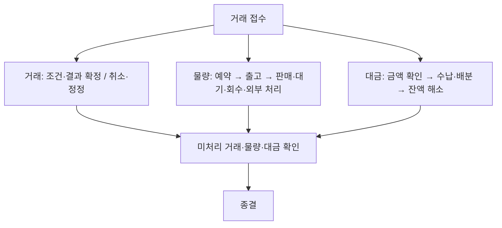
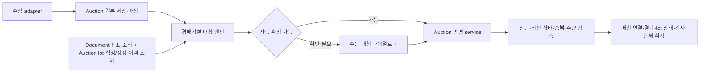

# ADR-003: Sales 상위 모듈의 내부 업무 경계와 공통 거래·물량·대금 흐름

- 상태: 승인 — 목표 설계, 구현 전환은 미완료
- 최초 결정일: 2026-09-19
- 전면 개정일: 2026-10-07, Asia/Seoul
- 범위: 일반 판매·경매 전표, 모듈 책임, 외부 결과 매칭, 반환 입고, 입금·예치금, 정정, 온라인 확장
- 관련 문서: [현재 판매·경매·정산 구현](../features/sales-auction-settlement.md), [현재 아키텍처](../04-architecture.md), [API 사용 원칙](../06-api-guide.md)

이 문서는 사용자와 확정한 목표 설계다. 현재 코드·OpenAPI의 구현 완료를 의미하지 않는다.
기존 화면 탭 중심 계획과 일반/경매 전표를 별도 최상위 모듈로 분리하던 제안은 이 결정으로 대체한다.
Sales는 판매 전체를 나타내며 기존 공통 전표·allocation·예약 대사를 유지한다.
현재 동작은 코드·OpenAPI와 위 구현 문서에서 확인하며, 각 기능 전환 시 관련 문서를 함께 갱신한다.

## 1. 배경과 실제 운영 조건

현재 일반 판매 전표와 경매 출하 전표는 `SalesSlip(DIRECT/AUCTION)`을 공유한다.
Sales가 전표·예약·출고·경매 출하 생성·일반 입금을 조율하고, Settlement가 경매 정산과
입금 원장·거래처 잔액을 함께 소유한다. 경매 결과 입력과 정산 구성은 별도 경로다.
현재 반환 확인은 lot의 반환 사실을 변경하며 농장 재고를 생성하지 않는다.

확정한 운영 조건은 다음과 같다.

- 출고는 항상 하나의 전표와 연결된다. 여러 전표를 하나의 출고에 합치는 모델은 도입하지 않는다.
- 경매 결과의 상장번호는 출하 전표와 직접 연결되지 않는다. 경매장·날짜·품목·비고를 함께 비교해야 한다.
- 동일 물건도 품목명·등급 표현이 달라질 수 있다. 기계적으로 정확한 식별을 기대하지 않는다.
- 주로 경매 결과만 확보할 수 있다. 정정은 사전 안내 후 다음 경매 결과에 포함되기도 한다.
- 유찰은 0원 행으로 나타나거나 결과에서 항목이 빠지기도 한다.
- 반환 추정은 특정 횟수 이상 경매 결과·정산 내역에서 누락된 물량을 표현하며, 주로 과거 데이터 이관을 위해 사용했다. 실제 운영의 기본 흐름으로 삼지 않는다.
- 실제 운영은 경매사와 연락한 뒤 유찰 물량의 재경매·농장으로 가져오기·경매장 폐기/처리 중 하나를 직접 결정한다. 반환 확정이라는 중간 선택 단계를 두지 않는다.
- 돌아온 난은 원래 묶음과 별도 묶음으로 만든다. 필요하면 이후 기존 transform으로 합친다.
- 손상·수량 부족·장기 유찰 물량은 경매장에 처리를 맡길 수 있다.
- 경매 대금은 주로 결과와 정확히 맞춰 입금된다. 소매·도매는 분할·합산 입금과 초과액의 예치금 사용이 있다.
- 확정 후에도 정정할 수 있어야 한다. 개발·운영자가 경매장별 엔진을 관리하고 성공한 경매 매칭은 자동 확정·반영한다. 미매칭·모호한 후보·검증 충돌만 수동 처리한다.
- 결과 수신 경로는 이메일·문자 등을 고려하지만 아직 미정이다. 일반 사용자가 수집 경로나 parser·매칭 규칙을 설정하지 않는다.
- 경매장이 정산을 수행한다. 농장은 결과·지급 내역을 확인하고 실제 입금과 대조하며, 별도 수수료·공제 계산을 하지 않는다.
- 온라인 판매는 실제 도입 계획이 없다. 기존 업무를 확장할 수 있는 계약만 고려한다.

보관된 시스템 지도는 당시 관찰 자료이며 현행 구현 기준으로 사용하지 않는다.

## 2. Sales 상위 모듈과 내부 사실의 소유권

Sales는 일반 판매·경매·입금·판매 거래처를 포함하는 판매 업무 전체의 상위 코드 모듈이다.
일반 판매만을 뜻하는 이름으로 사용하지 않는다. 별도 Gradle 프로젝트나 독립 배포 서비스로 분리하지 않는다.
DDD의 업무 영역, Bounded Context와 코드 패키지를 구분한다. Sales를 하나의 거대한 Bounded Context라고
단정하지 않고, 내부에서 모델의 의미와 쓰기 책임을 구분한다. 이후 실제 독립성이 필요할 때 경계를 추출할 수 있다.

```text
sales/
  document/     공통 전표·allocation·예약·출고 조율
  direct/       일반 판매 조건·금액·반품
  auction/      경매 lot·결과·매칭·유찰·반환·대금 내역
  payment/      실제 입금·배분·예치금
  partner/      판매 거래처·경매장 기준정보

farm/           실제 묶음·수량·예약 불변식·Mutation
```

위는 논리적인 기능 구분이다. 실제 계층별 패키지 배치는 구현 시 현재 구조와 architecture 규칙에 맞춰 정한다.
다음 내부 경계는 단순 폴더 분류가 아니라 application 계약과 쓰기 접근 검사로 보호한다.

| 경계 | 소유하는 사실·책임 | 다른 경계와의 관계 |
| --- | --- | --- |
| `sales.document` | 기존 공통 전표·품목·allocation·예약/출고 사실·snapshot·재고 이동·공통 취소 처리 | Farm Engine에 재고 변경 요청, Direct/Auction 정책을 반영한 상위 유스케이스로 실행 |
| `sales.direct` | 일반 판매 조건·확정 거래금액·받을 금액·금액 정정의 전용 저장 모델·수정/취소 자격·반품의 거래 의미 | 전표 ID로 Document와 연결, 공통 전표 변경은 Document API 사용, Payment에 일반 판매 대금 대상 계약 제공 |
| `sales.auction` | 출하 lot·시도·결과 원본·매칭·유찰 이후 재경매/농장 반환/경매장 처리 결정과 이력·과거 반환 추정·대금 묶음과 근거 연결 | 출하 전표는 Document API로 처리하고 반환품 생성은 Farm API로 요청, Payment에 경매 대금 대상 계약 제공 |
| `sales.payment` | 은행 거래·실제 수납·입금 배분·미배분액·예치금·예치금 사용·수납/배분 정정·거래처 수납/잔액 요약 | 대상 금액 검증과 요약 반영은 Direct와 Auction의 application 계약으로 수행 |
| `farm` | 실제 난 묶음·배치·수량·예약 불변식·Mutation·revision·snapshot | 판매 방식과 관계없이 실물·예약 변경을 검증하고 기록 |
| `sales.partner` | 거래처·경매장 이름·연락처·유형·활성 여부 등 기준정보 | Document·Direct·Auction·Payment와 판매 분석이 식별자와 application 값 계약으로 공유 |

Direct는 일반 판매의 조건·확정 거래금액·받을 금액과 금액 정정을 소유하고 전용 저장 모델로 관리한다.
기존 전표 테이블의 변경을 허용하며 일반 판매 금액을 계속 공통 전표 Entity에 저장하는 방식은 목표 설계로 채택하지 않는다.
Document는 공통 전표·품목·allocation과 물량 상태를 소유한다. 일반 판매 거래 모델은 기존 전표 ID로 연결하며
별도 전표·allocation을 복제하지 않는다. 품목별 거래 가격·금액도 Direct의 책임으로 구분한다.
Document의 출력용 금액 snapshot은 당시 사실이며 현재 받을 금액의 독립적인 원천이 아니다.
각 경계는 다른 경계의 Repository를 수정하지 않는다.
경매 전표도 Document가 소유하며 Auction이 별도 전표·allocation aggregate를 복제하지 않는다.

현재 독립 Auction은 `sales.auction`으로 편입하고 Settlement 모듈은 제거한다.
사용자가 확인한 기존 정산 데이터는 초기 경매 결과에서 생성된 파생 데이터이며,
독립적인 수정이나 신규 기록이 없다. 이 데이터와 정산 전용 테이블은 보존·이전하지 않는다.
정산 생성·재구성·시작 시 자동 실행과 전용 API도 제거한다. 별도 일괄 정산 기능으로 대체하지 않는다.
필요한 경매 금액은 Auction이 소유한 결과를 기준으로 조회·집계한다.

Settlement에 함께 있던 입금 이벤트·원장·잔액 관련 책임은 `sales.payment`로 옮기고,
신규 배분·예치금 기능도 이 경계에 둔다. 실제 입금 기록은 제거 대상인 파생 정산 데이터와 구분해 보존한다.
결과 합계와 경매장이 알려준 지급액을 구분한다. 별도 지급 자료가 없을 때
결과 합계를 경매장이 확정한 지급액이라고 표시하지 않는다.

현재 Partner의 거래처 유형과 업무 사용처는 도매·소매·경매장을 대상으로 하는 판매 영역이다.
독립 Partner는 `sales.partner`로 편입한다. 판매 분석에서 조회한다는 이유만으로 별도 최상위 모듈을 유지하지 않는다.
Partner는 거래처 기준정보를 소유하고 입금·예치금·잔액은 Payment가 소유한다.
Sales 내부에 포함해도 다른 기능이 Partner의 Entity·Repository를 직접 수정하지 않는다.
향후 구매처·공급업체 등 판매 밖의 업무가 동일한 거래처 기준정보를 공유해야 할 때 외부 경계 추출을 검토한다.
지금 구매 업무나 범용 거래처 모델을 추가하지 않는다.

Work·Audit·Print·Analytics·인증 등 기존 경계는 유지한다. Farm은 Sales 밖에 둔다.
경매장별 parser·matcher는 Auction 내부에, 은행 자료 수집·입금 매칭은 Payment 내부에 둔다.
수집·파싱·매칭마다 별도 top-level 모듈이나 범용 workflow 모듈을 만들지 않는다.

외부 모듈 및 Sales 내부 경계 사이에는 application API 또는 호출자가 정의한 port를 사용한다.
다른 경계의 Entity·Repository·테이블을 직접 사용하지 않으며, 여러 기능을 조합하는 최상위 application service가
트랜잭션을 조율한다. 접근·순환 의존·쓰기 소유권은 내부 패키지 단위 architecture test로 검사한다.
공통화하는 것은 전표와 재고 업무 기반이며 모든 판매 규칙을 Document에 몰아넣지 않는다.
Farm의 현재 내부 패키지 구분을 엄격한 데이터 소유 경계로 간주하지 않는다.

## 3. 공통 업무 흐름: 거래·물량·대금의 세 축

공통 업무 명칭은 `접수 → 예약 → 출고 → 거래 결과 확정 → 대금 확인 → 수납 → 종결`이다.
이는 설명·조회용 공통 흐름이며 모든 판매가 같은 순서로 실행되는 단일 상태 머신은 아니다.

| 축 | 공통 의미 | 일반 판매 | 경매 |
| --- | --- | --- | --- |
| 거래 | 접수·조건/결과 확정·취소·정정 | 구매자와 판매 조건·금액 확정 | 출하 접수 후 낙찰·유찰·반환 결과 확정 |
| 물량 | 예약·출고·대기·회수·처리 | 구매자에게 출고하고 필요 시 반품 입고 | 경매장 출하 후 판매·대기·반환·경매장 처리 추적 |
| 대금 | 받을 금액 확인·수납·배분·잔액 해소 | 전표 대금에 입금·예치금 배분 | 결과/지급 내역과 경매장 입금 대조 |



선입금·부분입금·일부 낙찰 후 입금처럼 각 축이 다른 속도로 진행할 수 있다.
Sales 내부의 Direct·Auction·Document·Payment가 각 책임에 맞는 상태 전이를 소유하고
서버가 공통 흐름의 조회값과 가능한 action을 제공한다.
종결은 미처리 물량·대금 등이 해소됐는지 판단하는 파생 개념이며, 정정 가능성을 없애는 영구 잠금이 아니다.
범용 Workflow Engine, 공통 판매 상속 계층, 모든 경로를 포괄하는 단일 상태 enum은 도입하지 않는다.

## 4. 공통 전표·allocation·예약 기반 유지

기존 `SalesSlip(DIRECT/AUCTION)`과 품목·allocation·예약·출고 snapshot·재고 이동 연결은
`sales.document`의 정식 공통 기반으로 유지한다. 경매 전표 분리를 위한 일시적인 호환 모델로 취급하지 않는다.
공통 전표의 식별·품목·물량 저장 모델을 공유하되 일반 판매 금액은 Direct의 전용 모델로 분리한다.
업무 의미와 금액 원천, 수정·취소·후속 처리 규칙은 유형별로 구분한다.

| 구분 | 일반 판매 전표 | 경매 출하 전표 |
| --- | --- | --- |
| 저장·공통 처리 소유 | Sales Document | Sales Document |
| 유형별 정책 | Sales Direct | Sales Auction |
| 의미 | 구매자와 합의한 판매 거래 | 경매장으로 보낼 품목·수량 |
| 가격·금액 | Direct 전용 모델의 판매 조건·확정 금액 | 출하 시점 정보와 Auction의 실제 낙찰액 분리 |
| 후속 연결 | 출고·입금·반품 | shipment·lot·결과·반환·경매 대금·입금 |

일반 판매·경매 모두 공통 전표 API로 예약·출고·취소를 처리한다. 경매 출하 완료 시 공통 출고 처리와
Auction의 shipment/lot 생성을 상위 유스케이스가 같은 트랜잭션으로 조율한다.
유형별 업무 조건은 해당 Domain Policy 한 곳에 두고 변경 API와 action 판단이 공유한다.
Document는 Auction의 결과 매칭이나 Payment의 입금 배분 엔진을 소유하지 않는다.
출고 기록은 정확히 하나의 전표를 식별한다. 한 전표의 분할 출고 지원 여부는 별도 상세 설계다.

현재 일반·경매의 작성중 allocation 합계를 Farm 예약량과 비교하는 대사는 유지한다.
패키지 이동 후에도 두 유형을 모두 포함하고, 일반 판매와 경매가 같은 묶음을 예약한 경우의 전체 합계를 검증한다.
예약·해제·출고·보상은 계속 Farm Engine으로 처리하고 기존 전표 ID·Mutation 출처·재고 이동·사용 참조 검사를 보존한다.
Sales의 내부 책임을 나누기 위해 별도 Auction 예약 원장을 만들거나 대사를 둘로 복제하지 않는다.

통합 전표 목록·정렬·pagination·번호 발급·출력 계약도 공통 기반에서 유지·개선한다.
Print는 공통 전표의 출력용 값 계약을 사용하고 일반/경매의 표현을 구분하며 A5 기준을 유지한다.

매출 원천은 일반 판매의 확정 거래와 경매의 확정 낙찰 결과다.
경매 출하 전표 금액을 낙찰 매출·미수·입금 상태로 사용하지 않고, 입금액도 매출로 중복 집계하지 않는다.
경매 출하 단가의 저장 정책은 전환 시 결정하며 기존 단가를 예상 단가로 재해석하지 않는다.
공통 전표에 낙찰·경매 시도·매칭·예치금까지 넣는 모델로 확대하지 않는다.

## 5. 운영 데이터와 연결된 경매 결과 자동 매칭

```text
외부 자료 수집 → 원본 보존 → 경매장별 파싱
  → 현재 전표·lot·과거 매칭 이력으로 판단
      ├─ 자동 확정 가능 → 반영 시 재검증 → 경매 결과 반영
      └─ 미매칭·모호·충돌 → 사용자 수동 매칭 → 같은 반영 검증
```

- 수집은 application port와 adapter로 연결한다. 이메일·문자 등 실제 경로는 확정 후 구현하며 파일·사진 업로드를 기본 사용자 흐름으로 가정하지 않는다.
- 원본 자료·출처·행 위치·수집 범위와 파싱 버전을 보존한다. 파싱 성공·매칭 확정·업무 반영을 구분한다.
- 상장번호는 외부 결과 식별에 활용한다. 출하 전표와 직접 연결되는 전역 키로 가정하지 않는다.
- 경매장·날짜·품목·비고를 함께 비교하고 수량·등급 등은 보조 근거로 사용한다.
- 경매장별 parser와 matcher를 분리한다. 원문을 보존하고 표현 차이를 별칭·규칙으로 관리한다.
- 개발·운영자가 관리하는 경매장별 엔진이 자동 확정 가능 여부를 판단한다. 일반 사용자는 엔진을 커스텀하거나 성공 항목을 전부 승인하지 않는다.
- 자동 확정할 수 없는 결과는 후보·판단 근거·충돌 사유와 함께 수동 처리 대상으로 보존한다. 사용자는 직접 lot를 선택하거나 연결 수량을 검토하고 보류·확정·정정한다.
- 결과 행·lot·시도 사이에 명시적인 연결과 적용 수량을 남긴다. 실제 자료 확인 없이 1:1 대응을 강제하지 않는다.
- 확정 시 현재 lot의 남은 물량·기존 결과·취소·반환·정정 여부를 다시 검증한다.
- 0원 결과와 누락을 경매장별로 해석한다. 한 번의 누락만으로 농장 반환 결정이나 실제 입고를 판단하지 않는다. 반복 누락의 추정 기준은 상세 설계하며, 확인한 자료 범위와 과거 이관/운영 검토를 구분하고 수집 실패를 반환으로 처리하지 않는다.
- 다음 결과에 포함된 정정은 이전 결과와 연결해 검토한다. 신규 낙찰로 무조건 추가하지 않는다.
- matcher 개선·재파싱은 새 해석을 만들며 기존 확정 연결과 업무 기록을 자동 덮어쓰지 않는다.

반복 수집 식별과 업무 중복 반영 방어는 별개다. checksum만으로 모든 거래 중복을 판정하지 않는다.
자료 형식·고유 번호의 범위·재경매 표현은 경매장별 실제 샘플로 확인한다.

### 5.1 매칭에 사용하는 운영 데이터

| 정보 | 판단 용도 |
| --- | --- |
| 경매 출하 전표·경매장·출하일·품목·비고·전표/lot 연결 | 후보 범위와 원출하 식별 |
| lot별 출하·낙찰·대기·반환·경매장 처리 수량과 현재 상태 | 연결 가능한 잔여 물량·취소·처리 여부 검증 |
| 이전 시도·결과·상장번호·결과 날짜 | 재경매·부분 낙찰·중복·정정 구분 |
| 과거 원문과 확정한 lot·시도 연결 | 동일 품목·등급의 다른 표현에 대한 매칭 근거 |
| 수동 정정·거절·보류 이력 | 과거 오매칭과 미확정 판단을 구분하고 반복 오류 방지 |

확정된 연결과 미검토 추정을 구분하고 정정으로 대체된 연결을 유효한 정답으로 재사용하지 않는다.
과거 이관 자료에 없는 원문·매칭 근거는 합성하지 않는다. 이력을 활용하는 엔진과 규칙의 개선은 개발·운영자가 관리한다.

### 5.2 조회·판단·반영의 분리

Auction application의 조회 component가 필요한 운영 정보를 일괄 조회해 매칭 context를 구성한다.
후보 범위를 경매장·날짜·상태 등으로 제한하고, 전체 운영 DB를 엔진 메모리에 올리거나 결과 행마다 반복 조회하지 않는다.
엔진은 context와 외부 결과를 받아 판단값을 반환하며 Repository 호출이나 업무 데이터 수정을 직접 수행하지 않는다.
공통 전표·allocation 정보는 Document application API로 받고, 다른 내부 경계나 외부 모듈의 정보도 application API 또는 port를 사용한다.



판단에 사용한 대상 식별자·상태/revision 또는 version·참조 이력·엔진 버전·판단 근거·최종 연결을 보존한다.
판단을 수행하는 동안 긴 쓰기 트랜잭션이나 lot 잠금을 유지하지 않는다. 실제 반영에서 lot를 잠그고
잔여 수량·기존 반영·취소·반환·정정 상태를 다시 검사한다. 판단 근거가 달라졌으면 재판단하거나 수동 처리로 넘긴다.
여러 결과가 같은 lot를 선택해도 중복·초과 수량을 반영하지 않도록 자동/수동 반영이 같은 쓰기 검증과 멱등 경계를 사용한다.
자동 확정된 결과도 사용자가 조회·정정할 수 있다. 원본 재수집이나 엔진 재실행이 이전 결과를 다시 반영하지 않게 한다.

## 6. 유찰 이후 결정·반환 입고·경매장 처리

유찰은 특정 경매 시도의 결과다. 유찰 물량을 재경매할지 후속 처리할지는 경매사와 연락한 뒤 사용자가 결정한다.
반환 추정은 반복 누락을 표현한 과거 이관 중심의 보조 상태이며 운영의 기본 결정 경로로 사용하지 않는다.
누락 자료를 받았다는 이유로 실제 사용자의 결정이나 입고/처리 완료를 자동 생성하지 않는다.

```text
유찰된 물량 → 후속 처리 결정
               ├─ 재경매 → 이후 경매 시도·결과
               ├─ 농장으로 가져오기 → 입고 대기 → 실제 입고 확인
               └─ 경매장에 폐기·처리 맡기기 → 결정과 함께 처리 완료 기록
```

후속 처리 결정은 세 가지 선택을 같은 단계에서 제공한다. `반환 확정`을 거친 뒤 처리 방법을 선택하는 모델은 사용하지 않는다.
농장으로 가져오기로 한 결정과 실제 입고는 구분한다. 경매장 폐기·처리는 사용자의 결정을 기록하면 해당 물량의 처리가 끝나며
별도의 처리 대기·처리 확인 단계를 요구하지 않는다. 경매장 처리를 농장 입고나 Farm 재고 복구로 해석하지 않는다.
재경매 결정이 이미 유효한 경우 매 유찰마다 이를 초기화하는 규칙을 추가하지 않는다.

| 구분 | 표현할 상태·사실 |
| --- | --- |
| 경매 시도의 결과 | 낙찰·부분 낙찰·유찰 등 해당 회차의 결과 |
| 유찰 물량의 결정 | 결정 대기 후 재경매·농장으로 가져오기·경매장 폐기/처리 중 직접 선택 |
| 농장 반환 진행 | 입고 대기·부분 입고·입고 완료와 실제 입고 수량/일자 |
| 경매장 폐기·처리 | 결정 시 대상 수량의 처리 완료 기록. 별도의 대기/확인 상태 없음 |
| 과거 추정·검토 | 반환 추정·수량 차이 확인 필요. 사용자 결정이나 실제 실행 사실과 구분 |

표는 상태의 개념과 책임을 구분하며 이를 하나의 lot enum에 모두 추가한다는 결정은 아니다.
현재 구현 범위에서는 같은 lot의 유찰 잔량 전체에 하나의 처리 방법을 선택한다.
재경매·농장 반환·경매장 처리로 잔량을 동시에 나누는 기능과 화면은 구현하지 않는다.
부분 낙찰은 지원하며, 농장 반환을 선택한 잔량의 부분 입고도 지원한다.
예를 들어 100개 중 60개가 낙찰되고 남은 40개를 농장 반환으로 결정했다면,
30개가 먼저 도착해도 나머지 10개는 같은 반환 결정에 따른 입고 대기로 남는다.
처리 기록에는 결정 당시 대상 수량·방법·실제 실행 수량·일자·변경 이력을 명시해 lot 요약과 구분한다.
향후 실제 분할 처리 요구가 생기면 이 기록을 기반으로 확장한다. 지금 범용 분할 엔진이나 여러 방법의 동시 배분 규칙을 만들지 않는다.
특히 반환 결정량·반환 추정량·실제 입고량을 같은 수량 필드로 취급하지 않는다.
부분 입고 후 남은 물량의 처리 결정은 유지하고, 아직 도착하지 않은 물량을 자동으로 재경매 대기로 돌리지 않는다.
상세 수량 보존식과 결정 변경·수량 부족·유실·정정 규칙은 후속 논의에서 확정한다.

실제 농장 도착을 확인한 수량으로 별도 묶음을 만들고 입고 사실에 연결한다.
확인·입고를 반복해도 같은 물량을 두 번 생성하지 않으며 부분 입고 후 미입고 잔량을 계속 추적한다.

농장 반환의 `입고 대기`는 Auction이 관리하는 아직 농장에 도착하지 않은 물량이다.
기존 Farm 입고 메뉴·InboundRecord·포트 작업 흐름에 연결하지 않는다. 여기서 입고는 반환품의 실제 도착을 뜻한다.
판매 관리의 경매 상세에서 실제 반환을 확인하고 Sales 상위 유스케이스가 Farm의 application 계약으로
새 묶음 생성·논리 구역 배치·Mutation을 요청한다. Farm의 기존 생성/배치 규칙과 Engine은 재사용하지만
일반 입고 API를 경매 반환의 진입점으로 사용하지 않는다. 반환품 생성 계약이 없으면 Farm 소유 API로 추가한다.
Auction은 반환 결정·실제 도착 기록·새 묶음·Mutation 식별자를 연결하고 Farm은 판매 Entity에 의존하지 않는다.
실제 반환의 취소/정정도 Auction 물량과 Farm 재고 효과가 함께 반영되는 상위 유스케이스를 사용한다.
실제 반환 기록의 소유권을 Farm Inbound로 옮기거나 별도 입고 등록을 사용자에게 요구하지 않는다.

일반 판매의 실물 반품도 Direct가 거래 사실과 업무 규칙을 소유하고 Farm의 재고 기능을 application 계약으로 사용한다.
금액 환불과 실물 반품은 독립된 사실이다. 환불만으로 Farm 재고나 입고 기록을 생성하지 않고,
실물 반품만으로 자동 환불하지 않는다. 반환 묶음의 구체적인 처리 규칙은 일반 판매의 반품 정책에서 정한다.

- Auction은 후속 처리 결정·방법·대상 물량과 실제 입고/경매장 처리 사실을 소유한다.
- Farm은 실제 도착량·상태·논리 구역·배치를 검증하고 반환품의 새 묶음을 생성한다.
- 원출하·lot·반환 입고·새 묶음·생성 Mutation을 추적 가능하게 연결한다.
- 원래 묶음의 수량을 자동 복구하지 않는다. 합치는 작업은 기존 transform과 그 이력을 사용한다.
- 경매장 폐기·처리는 결정 시 수량·사유·실행자·시각을 기록하고 대상 물량의 처리를 완료한다. 별도의 완료 확인을 기다리지 않으며 중복 결정으로 같은 수량을 두 번 처리하지 않는다.
- 농장에 돌아오지 않은 물량에 가상 입고·폐기 Mutation을 만들지 않는다. 수량 부족·손상·미확인 차이도 사실대로 남긴다.

전표 취소, 실제 회수, 경매장 처리는 별개다. 낙찰·반환 등의 후속 사실이 생긴 출하를
전표 취소로 되돌려 전체 재고를 복구하지 않는다. 기존 취소 보호를 유지하고 명시적인 정정·회수 흐름을 추가한다.

## 7. 실제 입금·배분·예치금

은행 거래는 실제 돈의 이동을, 전표·경매 대금은 받을 금액을 나타낸다. 둘의 연결은 Payment가 소유한다.

- 하나의 입금을 여러 전표·경매 대금에 배분하고 여러 입금을 하나의 대상에 누적할 수 있다.
- 입금액, 배분액, 미배분액, 예치금 전환/사용을 구분한다. 같은 돈을 중복 배분·사용하지 않는다.
- 소매·도매 초과액은 예치금으로 사용할 수 있게 한다. 미확인 입금을 임의 거래처의 예치금으로 확정하지 않는다.
- 경매 입금은 결과·지급 내역과 대조하고 차이는 검토 대상으로 보존한다. 임의 공제·0원 보정으로 맞추지 않는다.
- 은행 내역과 기존 수동 입금이 같은 사실이면 증빙만 연결한다. 입금 이벤트와 잔액을 다시 증가시키지 않는다.
- 입금 대상은 자기 모듈에서 받을 금액·배분 가능액·취소/정정 가능 여부를 검증한다.
- 거래처 잔액 요약은 대상 금액과 입금/예치금 배분을 일관되게 반영하며 별도의 독립 금액 원천이 되지 않는다.

입금·배분·예치금은 목표 지원 범위다. 기존 enum·잔액 필드 존재만으로 구현된 기능으로 취급하지 않는다.
예치금 환불과 출금 자동 처리의 상세 정책은 이 결정에 포함하지 않는다.
일반 판매 환불의 거래 사유·가능 여부는 Direct의 책임이고 금전 반환 기록은 Payment의 책임이다.
환불과 실물 반품/반환의 연결은 명시적으로 기록하되 기존 Farm 입고 기능을 필수 경로로 사용하지 않는다.

### 7.1. 경매 입금 대상: 같은 근거로 연결된 대금 묶음

경매 결과와 그에 따른 정산 내역은 보통 함께 제공된다. 정산 내역에는 전체 경락 금액만 있을 수도 있다.
Auction은 함께 제공된 근거와 그 근거로 매칭된 결과·lot를 연결한 경매 대금 묶음을 소유한다.
Payment는 개별 lot나 출하 전표 금액 대신 이 묶음을 경매 입금 대상으로 사용한다.
묶음은 안정적인 식별자로 참조하며 원본 근거·매칭 결과·정정 연결을 추적할 수 있어야 한다.
이는 외부 자료와 대상의 연결을 기록하는 모델이며 자체 수수료 계산이나 기존 파생 Settlement의 복원이 아니다.

매칭을 입금 대상 연결보다 먼저 완료한다. 미매칭·모호·충돌이 남은 경매 결과·정산 내역은
`확인 필요` 등 미완 상태로 보존하고, 일부 매칭 결과만으로 전체 대상 연결을 완료하지 않는다.
필요한 매칭이 완료된 뒤 대금 묶음의 입금 대상 연결을 마무리한다.
이 조건은 묶음에 대한 연결 완료 조건이며, 은행 원본 거래 수집 자체와는 구분한다.

과거 거래의 정정이 다음 경매 결과·정산 내역에 표시되거나 사용자가 사전에 알고 있는 경우,
해당 자료 또는 사용자 확인 근거를 과거 결과·대금 묶음과 연결하고 별도 정정 항목으로 처리할 수 있게 한다.
정정 항목을 새로운 lot의 낙찰로 취급하거나 원본과 기존 연결을 덮어쓰지 않는다.
이번 대금에 포함되는 조정과 과거 거래의 정정을 추적 가능하게 연결하되,
기존 입금 배분의 변경·초과액 처리·환불 등 금액 효과는 별도 정책과 검증으로 확정한다.

### 7.2. 금액 소유권과 유효 배분 합계

일반 판매에서 받을 금액은 Direct의 전용 저장 모델이, 경매에서 받을 금액은 Auction의 대금 묶음이 소유한다.
Payment는 실제 수납과 그 돈을 어디에 사용했는지 나타내는 배분·예치금 사용 사실을 소유한다.
Payment는 Direct/Auction의 application 계약으로 대상 금액과 배분 가능 여부를 검증한다.
전표 화면·출력·분석은 각 소유 경계의 조회 계약을 조합하고 공통 전표 금액을 다시 대금 원천으로 사용하지 않는다.

`paidAmount`는 해당 대상에 유효하게 배분된 금액의 합계로 정의한다. 예치금 사용으로 충당한 금액도 포함하며,
은행 입금 전체 금액이나 사용자가 독립적으로 입력하는 전표 필드로 취급하지 않는다.
배분 취소·정정 이력을 반영한 유효 합계로 대상의 수납액·미수 잔액·수납 상태를 산출한다.
성능상 이 합계를 저장하면 해당 대상의 조회용 요약값으로 관리하고, 배분 변경과 같은 트랜잭션에서 갱신한다.
Payment 기록과 요약값을 대사할 수 있어야 하며 다른 경계에서 수납액을 독립적으로 수정하지 않는다.

하나의 수납을 여러 대상에 배분하거나 배분 대상을 변경해도 실제 수납 사실을 다시 생성하지 않는다.
예치금 사용도 기존 돈의 사용으로 기록한다. 은행 증빙과 기존 수동 입금이 같은 사실이면 증빙만 연결한다.
받을 금액 정정으로 유효 배분액이 대상 금액을 초과하면 거래처·상황별로 여러 처리 방법을 지원한다.
일반 판매에서는 예치금 전환 또는 환불 대상으로의 분류 등을 선택할 수 있어야 하며 하나의 방법으로 고정하지 않는다.
경매에서는 드문 상황이지만 다음 자료의 조정 연결 등 명시적인 예외 처리를 지원한다.
처리 방법·대상·금액·사유와 원래 배분/정정의 연결을 기록하고, 초과액과 미처리 여부를 조회할 수 있게 한다.
환불 대상으로 분류한 사실과 실제 돈을 환불한 사실은 구분한다. 자동 환불 실행이나 계좌 출금 연동을 이번 결정에 포함하지 않는다.
구체적인 추가 처리 수단·자동화·거래처별 기본값·승인 조건은 상세 정책에서 정한다.

## 8. 정정·트랜잭션·Mutation 경계

확정한 결과·입금·배분도 정정할 수 있다. 원본과 기존 기록을 보존하고 취소·정정·재반영의 연결,
실행자·시각·사유를 남긴다. 후속 대금·입금·물량 효과를 검증한 뒤 필요한 보상만 수행한다.
금액이나 매칭 정정만으로 Farm 재고를 자동 변경하지 않는다.

| 업무 | 같은 트랜잭션에서 확정하거나 rollback할 사실 |
| --- | --- |
| 전표 접수·예약 | 소유 전표·allocation·일반 판매의 Direct 거래/금액 모델·예약 Mutation·이동 이력·snapshot·감사·요청 접수 |
| 출고·출하 완료 | 전표 상태·출고 사실·경매 shipment/lot·예약 소비 Mutation·snapshot·감사 |
| 경매 결과 반영 | 원본/해석 연결·확정 매칭·시도/결과·lot 상태·처리 접수·감사 |
| 실제 반환 입고 | Auction 실제 도착 기록·수량 사용 기록·새 묶음·생성 Mutation·감사. 농장으로 가져오기로 한 결정과 구분하며 Farm InboundRecord를 생성하지 않음 |
| 경매장 폐기·처리 결정 | Auction 대상 물량의 처리 기록·수량/상태·감사·접수. 결정 시 완료하고 Farm 재고는 변경하지 않음 |
| 입금·예치금 배분 | 입금 사용액·배분/사용 기록·대상 금액 상태·잔액·감사·접수 |
| 확정 후 정정 | 정정 연결·대상 변경·필요한 금액/재고 보상·감사·접수 |

경매 대금 확인은 결과 반영과 독립된 업무로 둘 수 있다. 모든 수집 결과를 하나의 거대한 트랜잭션에 넣지 않는다.
외부 다운로드·조회는 DB 트랜잭션 밖에서 수행하고, 내부 확정의 최상위 application service가 경계를 연다.

- 판매 경로의 예약·해제·출고·취소 보상·실제 입고는 Farm Engine으로 실물/예약을 변경한다. 낙찰은 이미 출하한 물량을 다시 차감하지 않는다.
- 요청 재전송, 원본 재수집, 업무 재반영, 정정은 서로 다른 식별·지문으로 구분한다.
- 필요한 UNIQUE/CHECK·version·행 잠금을 함께 사용하고 충돌 시 전체 확정을 거절한다.
- 기존 단건 API를 반복 호출해 다중 대상 배분을 구현하지 않는다. 기존 취소·입금·결과 경로를 포함해 잠금 순서를 설계하고 동시 실행을 검증한다.
- 현재 판매 입금의 전표→거래처와 경매 입금의 거래처→정산 순서가 신규 bulk 흐름에도 안전하다고 가정하지 않는다.
- Payment는 대상 처리 port를 정의하고 Direct·Auction이 구현하는 등 내부의 소스 의존과 런타임 호출을 분리해 순환을 피한다.
- 업무 snapshot·Mutation·외부 원본·금액 원장은 서로 다른 사실이다. 공통 범용 이벤트 테이블로 합치지 않는다.

### 8.1. 유스케이스 조율과 내부 의존 방향

둘 이상의 판매 기능을 변경하는 유스케이스는 Sales 상위 application에 둔다.
현재 계층 구조에서는 `sales.application.usecase` 등의 위치로 구성하고 기능별 application API를 호출한다.
이 조율 계층은 새 업무 모듈이나 범용 Workflow Engine이 아니며 Entity·Repository·독립 업무 규칙을 소유하지 않는다.
각 유스케이스가 실제로 필요한 서비스만 조합한다. 단일 기능 처리를 모두 상위 계층으로 감싸거나
모든 서비스에 interface·복제 DTO를 추가하지 않는다.

소스 의존과 런타임 호출은 다음 기준으로 구분한다.

- 상위 유스케이스와 통합 조회 조립은 Document·Direct·Auction·Payment·Partner의 application 공개 계약에 의존한다.
- Document는 공통 전표·품목·allocation과 Farm 재고 계약에 집중한다. Direct/Auction의 구체 서비스나 Payment를 역으로 호출하지 않는다.
- Direct/Auction은 필요한 전표 정보를 Document의 값 조회 계약으로 받는다. 공통 전표 변경과 후속 기능 변경을 함께 수행하는 순서는 상위 유스케이스가 조율한다.
- Payment는 자신이 정의한 대상 처리 port에 의존한다. Direct/Auction 쪽 adapter가 이를 구현해 대상 잠금·검증·수납 요약 반영을 자기 application API에 위임한다.
- Direct/Auction의 port 구현 의존은 Payment의 좁은 계약으로 제한한다. 해당 구현이 Payment 서비스로 다시 들어가 배분을 변경하는 순환 호출은 허용하지 않는다.
- Partner는 기준정보·잠금 계약을 제공하고 다른 판매 기능을 호출하지 않는다. Farm도 판매 유형이나 판매 Entity를 알지 않는다.
- 외부 수집 adapter와 parser/matcher는 소유 기능 안에 둔다. 조율 계층을 직접 호출하는 domain 객체나 Repository는 만들지 않는다.

공통 전표의 action과 변경 가능 여부를 판단할 때는 통합 조회 조립에서 각 기능의 사실을 일괄 조회하고
소유 Domain Policy에 전달한다. 변경 유스케이스도 잠금 후 최신 사실에 같은 Policy를 적용한다.
조회용 action과 쓰기용 검증을 서로 다른 조건문으로 구현하거나 목록 행마다 기능 API를 호출하지 않는다.

| 유스케이스 | 트랜잭션을 여는 위치와 조율 |
| --- | --- |
| 일반 판매 생성·수정 | 상위 판매 유스케이스: 요청 접수 → Document 전표/품목과 Direct 거래/금액 생성·변경 → Document를 통한 Farm 예약/재예약 → 필요한 요약·snapshot·감사·응답 접수 완료 |
| 출고·경매 출하 | 상위 완료 유스케이스: 최신 전표·유형별 정책 검증 → 출고 snapshot과 공통 출고 처리 → 경매이면 Auction shipment/lot 생성과 Document 식별자 연결 → 감사·접수 완료 |
| 전표 취소 | 상위 취소 유스케이스: Document·Direct/Auction·Payment의 후속 사실을 잠금 아래 검증 → 취소 가능한 업무 사실 정리·예약 해제/허용된 출고 보상 → 전표 상태·감사·접수 완료 |
| 실제 경매 반환 입고 | 상위 반환 유스케이스: Auction 반환 대상 검증 → Farm 생성/배치 application API를 통한 새 묶음·Mutation → Auction 실제 도착과 새 묶음/Mutation 연결 → 감사·접수 완료. 기존 입고 API를 거치지 않으며 상세 수량 정책은 후속 논의 |
| 경매장 폐기·처리 결정 | Auction 최상위 유스케이스: 대상 수량 검증 → 결정·처리 완료 기록 → 수량/상태·감사·접수 완료. Farm 입고/폐기 API를 호출하지 않음 |
| 수납·다중 대상 배분·예치금 사용 | Payment 최상위 유스케이스: 접수·공유 잠금 → 원천 사용 가능액과 대상 port 검증 → Payment 배분/사용 기록 → 대상 수납 요약·거래처 잔액 → 감사·접수 완료 |
| 거래금액 정정과 초과 배분 처리 | 상위 금액 정정 유스케이스: Direct/Auction 금액 정정과 Payment의 배분 영향 검토를 조율. 선택한 처리 또는 확인 필요 사실·대상 요약·감사·접수는 함께 확정 |
| 경매 결과 자동/수동 반영 | Auction 최상위 반영 유스케이스: 원본·판단 결과를 받아 잠금/재검증 후 결과·매칭·lot 사실을 함께 확정. 대금 묶음 연결은 매칭 완료 조건을 적용 |

표는 조율 책임과 같은 트랜잭션에 포함할 사실을 정의하며 실제 SQL 실행·잠금 순서를 대신하지 않는다.
DB 변경을 하는 내부 application API는 호출 트랜잭션에 참여한다. 조율 전용 쓰기·잠금 API는 `MANDATORY`를 사용하고
정합성을 함께 보장할 사실을 `REQUIRES_NEW`나 after-commit listener로 분리하지 않는다.
외부 수집·은행 조회·matcher 판단은 쓰기 트랜잭션 밖에서 수행하며 실패한 자료의 상태 기록은 업무 반영과 구분한다.
현재 같은 DB의 원자적 처리로 충분하므로 메시지 브로커·Saga·범용 분산 트랜잭션을 추가하지 않는다.

### 8.2. 잠금·접수·회귀의 전환 기준

각 조율 유스케이스는 사용할 대상 ID를 먼저 수집하고 중복 제거·정렬한 뒤 잠금을 취득한다.
잠금 전 조회는 잠글 범위를 찾는 용도이며, 잠금 후 거래처·전표·대상·수납 원천의 관계와 최신 상태를 다시 검증한다.
여러 거래처를 변경하는 경우 거래처 ID 오름차순을 유지한다.
거래처와 전표/대금 대상을 함께 잠그는 판매 흐름은 거래처를 먼저 잠그도록 통일하는 것을 목표로 한다.
그 뒤 전표·Direct 대상·Auction lot/대금 묶음·수납/예치금 원천 등 필요한 root의 공통 순위를 정하고,
동일 종류는 ID 순서로 잠근다. 대상 처리 port는 이 순위에 맞춘 잠금 단계와 변경 단계를 제공해야 한다.
수량 변경은 기존 Farm의 묶음·논리 구역 등 잠금 규칙과 결합해 검증하며 여기서 임의의 새 Farm 순서를 만들지 않는다.

실제 root의 전체 순위와 FK/원장 내부 잠금까지 포함한 계획은 저장 모델을 확정한 뒤 코드 경로별로 검증한다.
현재 일반 판매의 전표→거래처 순서가 목표와 다르므로 생성·수정·취소·입금·정정의 기존 경로를 함께 전환한다.
새 배분 API 하나만 바꾸고 기존 순서를 남기지 않는다. 잠금 이후 앞 단계의 root를 추가로 잠그는 숨은 호출은 금지한다.

접수와 멱등키는 유스케이스별 소유권을 유지한다. 상위 조율에서 완료 접수를 확인하면
기존 응답을 반환하고 기능별 쓰기나 Farm Mutation을 다시 수행하지 않는다.
요청 접수·업무 변경·원장/배분·Mutation·요약·감사·응답 접수 완료는 같은 트랜잭션에서 확정/rollback한다.
경매 원본 중복 식별과 반영 접수는 별개로 유지하며 기존 영속 지문·응답 snapshot의 호환을 검증한다.

architecture test는 내부 공개 API·port 외 접근, Entity/Repository 참조, 소스 순환,
Document의 구체 Direct/Auction/Payment 서비스 의존과 Partner의 역방향 호출을 검사한다.
PostgreSQL 회귀는 전표+Direct 생성 실패, 출하 lot 생성/재고 변경 실패, 반환품 배치 실패,
배분 요약 갱신 실패와 동시 입금/취소·금액 정정/배분·결과 반영/출하 취소를 포함한다.
반환의 결정/실행 구분은 6절을 따르며 상세 수량 보존식·부분 실행·결정 변경·수량 부족/유실·정정 규칙은 후속 도메인 논의에서 확정한다.

## 9. 화면·조회 계약

판매 관리의 메뉴는 다음 네 개로 확정한다. 백엔드 모듈과 메뉴를 일대일로 대응시키지 않는다.

```text
판매 관리
  ├─ 전표
  ├─ 경매
  ├─ 입금
  └─ 거래처
```

| 페이지 | 사용자 업무 |
| --- | --- |
| 전표 | 일반 판매·경매 출하 통합 목록, 유형 필터, 각각의 등록·상세·출고/출하 처리 |
| 경매 | lot별 결과·유찰·대기·반환·경매장 처리·대금 추적과 매칭 확인 필요 건 처리 |
| 입금 | 실제 입금 조회·매칭/배분·예치금 처리와 전표/경매 대금 대조 |
| 거래처 | 거래처·경매장 기준정보 관리 |

경매 아래에 결과·반환·대금 등의 세 번째 탐색 메뉴를 만들지 않는다. 목록 필터와 선택 lot의 상세·이력·가능 action으로 구성한다.
경매 페이지의 `매칭 확인 필요 · N건`에서 넓은 다이얼로그를 열어 미매칭·충돌·보류 결과를 처리한다.
다이얼로그는 원본 결과 목록과 선택 결과의 후보 lot·추천 근거·직접 검색·연결 수량·보류/확정을 같은 공간에 제공한다.
후보 선택을 위해 다이얼로그를 중첩하지 않고 작은 화면에서는 전체 화면으로 확장한다.
자동 처리된 결과도 조회·정정할 수 있게 하되 일반 사용자가 모든 성공 결과를 검토해야 하는 흐름은 만들지 않는다.

보류·확정 등 저장된 상태는 다이얼로그를 닫아도 서버에 남아 다음에 이어서 처리할 수 있어야 한다.
미저장 입력이 있는 상태의 닫기는 확인하고, 처리 중 중복 확정·정정을 막는다. 진입점과 처리 건수를 상시 제공한다.
선택한 검토 대상과 다이얼로그 진입 상태는 URL로 복원할 수 있게 하고 입력 중인 값은 local UI state로 둔다.
수집 시각·수집 실패와 매칭 확인 필요 상태를 구분해 표시한다. 일반 화면에는 수신 계정·parser·규칙 설정이나 엔진 튜닝을 노출하지 않는다.
수집 연결과 엔진 설정은 개발·운영 책임이며 운영용 관리 방식은 실제 수신 경로를 정한 뒤 설계한다.

일반·경매 전표는 한 목록에서 유형 필터로 함께 조회한다.
공통 목록에는 의미가 같은 정보를 표시하고 일반 판매 금액·경매 낙찰액·경매 지급 안내액·실제 입금을 구분한다.
등록 진입점은 일반 판매와 경매 출하의 업무 의미를 먼저 드러낸다. A5 출력 기준을 유지한다.

전표→출하/lot→외부 결과/확정 연결→경매 대금→실제 입금과 반환품 묶음을 양방향으로 추적한다.
공통 workflow 표시와 action은 서버 계약을 사용하고 프론트가 enum 조합으로 업무 규칙을 다시 만들지 않는다.
필터·페이지·상세 선택·입금 이력 선택은 URL로 복원하고 API 응답은 React Query cache에 둔다.

미지원 수정·품목 개수 변경을 노출하지 않고 allocation 사전 안내와 서버 검증을 함께 유지한다.
동작 없는 복사·고정 담당자·일반 전표의 LOT 표기는 정리한다. 구체적인 화면 배치와 query 이름은 UI/API 상세 설계에서 정한다.

## 10. 온라인 확장과 도입하지 않을 추상화

온라인 주문은 Sales Direct의 새로운 접수 채널로 확장할 수 있도록 application API를 유지한다.
온라인에서도 기존 Document의 전표·allocation·예약·출고와 Payment의 수납·배분을 재사용할 수 있게 한다.
거래·물량·대금의 공통 의미를 사용하되 결제·배송·반품의 구체적인 전이는 실제 도입 시 정한다.
주문 접수만으로 자동 출고하지 않는다. 향후 플랫폼 지급 내역이 필요해지면 실제 자료와 운영에 맞춰 경계를 추가한다.

지금 주문 플랫폼·결제 gateway·플랫폼 정산을 구현하거나 범용 수수료 계산기를 만들지 않는다.
경매 결과 자동 매칭은 이 ADR의 목표 범위에 포함한다. 계좌 입금 자동 확정의 범위는 별도로 상세 설계하며 경매 엔진의 자동 확정 정책을 그대로 적용하지 않는다.
모든 경로의 상태와 업무 규칙을 공통 전표 aggregate에 넣거나 현재 경매 내역을 범용 Settlement 모델로 확장하지 않는다.

## 11. 전환 순서와 데이터 보존

1. 현재 전표·lot·결과·입금·예약·snapshot·Mutation의 연결과 잠금 순서를 정리하고 회귀 기준을 확정한다. 제거할 파생 정산에 대한 호출·조회·입금 대상 참조도 조사한다.
2. 기존 공통 전표·allocation·예약 대사를 Document에 유지하면서 일반 판매 정책·금액을 Direct 전용 저장 모델로 분리한다. 전표 ID 연결·내부 API·접근 검사·기존 응답 호환과 저장 데이터 이전을 설계한다.
3. 기존 Auction을 `sales.auction`으로, Partner를 `sales.partner`로, Settlement의 입금·원장·잔액 책임을 `sales.payment`로 편입한다. 거래처 테이블·ID·참조는 유지하고 판매 분석도 Partner application 계약을 사용한다. 경매 금액 조회와 입금 대상 참조를 결과 기반 계약으로 전환한 뒤 Settlement의 파생 데이터·전용 테이블·API·생성/재구성 코드를 제거한다. 기존 최상위 경로는 호환 전환 후 제거한다.
4. 실제 경매장 자료로 원본 보존·parser·운영 데이터 context·경매장별 matcher·자동 반영·예외 수동 매칭을 구현한다. 수신 adapter는 경로 확정 후 연결한다.
5. 유찰 물량에서 재경매·농장으로 가져오기·경매장 폐기/처리를 직접 선택하는 흐름과 판매 쪽 실제 반환 확인/Farm 반환품 생성·결정 시 완료되는 경매장 처리·확정 후 정정의 경계를 구현한다. 기존 입고 기능에 반환을 연결하거나 과거 반환 추정을 운영의 기본 흐름으로 확장하지 않는다.
6. 은행 수집·기존 입금 증빙 연결·분할/합산 배분·예치금 사용·정정을 구현한다.
7. 전표·경매·입금·거래처 네 메뉴, 통합 목록·추적·매칭 다이얼로그·공통 workflow 표시를 구현하고 온라인 연동은 실제 도입 때 별도로 추진한다.

패키지 이동과 데이터 모델 전환을 구분한다. 공통 전표·allocation·거래처 테이블과 ID는 유지하고 일반/경매 전표를 별도 테이블로 분할하지 않는다.
공통 전표 테이블 유지가 현재 모든 컬럼의 유지를 뜻하지는 않는다. 일반 판매 조건·금액을 Direct 전용 모델로
이전하고 기존 공통 전표·품목의 금액 컬럼과 수납 요약은 소유권에 맞춰 변경한다.
기존 거래금액·품목 금액·수납액·잔액과 실제 원장 기록을 비교한 뒤 이전하며, 불일치는 검토 대상으로 남긴다.
과거 거래금액을 현재 품목 값으로 다시 계산하거나 수납 요약만으로 새 수납·배분 사실을 합성하지 않는다.
기존 입금 대상 참조·멱등키·저장된 재전송 응답과 출력 snapshot의 호환을 검증한 뒤 불필요한 컬럼을 제거한다.
새 매칭·경매 대금 묶음/근거 연결·입금 배분·반환·정정 기록에 필요한 schema 확장은 별도로 설계한다.
과거 전표·lot·경매 결과·실제 입금·Mutation/receipt·snapshot·원장 연결과 그 정합성을 보존하는 migration을 먼저 설계한다.
파생 정산 테이블은 보존 대상에서 제외한다. 해당 테이블을 참조하는 FK·입금 대상 식별자·조회 경로를
해소한 뒤 새 migration으로 테이블과 불필요한 제약을 제거한다. 적용된 Flyway 파일과 적용 이력은 유지한다.
이 제거를 위해 파생 정산 이력을 새 모델에 복제하거나 별도 보관 테이블을 만들지 않는다.
과거 자료를 추정 매칭하거나 입금 출처·실행자를 합성하지 않는다. 필요 시 명시적인 검토·연결만 추가한다.

기존 반품 수량의 음수·금액의 비음수 표현 전환 계획은 유지한다. 거래 의미와 재고 효과를 분리하며
반품 전표 작성만으로 재고를 복구하지 않는다. 현재 과거 음수 금액은 backfill 없이 보존한다.
금액형·계산 범위·overflow·잔액 부호의 전환은 별도 검증 대상이다.
시작 시 자동 정산과 별도 일괄 재구성으로 대체하려던 계획은 폐기한다. 파생 정산을 생성하는 경로를 제거하고
필요한 결과 합계는 조회 시 집계한다. 향후 성능 때문에 집계 최적화가 필요해도 별도 정산 업무 모델을 복원하지 않는다.

상세 설계가 필요한 항목은 분할 출고, 결과 행/lot 대응 단위, 이메일·문자 등 수신 경로,
경매장별 원본 중복·정정 식별과 자동 확정 기준, 계좌 매칭 자동화 범위, 초과 배분의 복수 처리 수단·예치금 전환·정정 세부 규칙과 환불 범위,
경매 출하 단가 저장 정책, migration/API 호환 전략이다.
경매의 후속 처리 세 가지 직접 선택, 유찰 잔량 전체에 한 가지 방법 선택, 부분 낙찰/부분 입고 지원, 농장 반환 결정/실제 입고 구분과 경매장 처리의 결정 시 완료는 확정했다. 여러 방법으로 잔량을 나누는 기능은 향후 실제 요구가 생길 때 확장한다. 상세 수량 보존식·결정 변경·수량 부족/유실·정정 규칙은 계속 논의한다.
이는 위 소유권·엔진 자동 매칭과 예외 수동 처리·별도 반환 묶음·공통 흐름·네 메뉴의 결정을 다시 여는 항목이 아니다.

## 12. 검증과 결과

구현 시 다음 회귀를 완료 기준으로 둔다.

- Sales 외부 및 내부 Document/Direct/Auction/Payment/Partner의 Entity/Repository 소유권·순환 의존 방어와 채널에 독립적인 application 계약.
- Partner 편입 전후 거래처 조회·검색·활성 여부·기존 ID/참조·판매 분석의 호환, Partner 기준정보와 Payment 금액 원장의 쓰기 소유권 분리.
- 공통 전표의 일반/경매 정책·예약·출고·취소·snapshot·Mutation·감사 원자성, 실패 rollback·동시 충돌·재전송.
- Direct 전용 모델의 전표 연결·기존 거래금액/품목 금액 이전, 전표/Direct/예약의 원자성, Direct 금액 계약을 사용하는 통합 조회·분석·A5 출력·과거 생성 응답의 호환.
- 동일 묶음에 일반 판매·경매 예약이 공존할 때 전체 allocation 대사와 유형별 취소·출고 후 잔여 예약 검증.
- 경매장별 표현 차이·0원·누락·부분 결과·재경매·뒤늦은 정정·원본 재수집·자동 확정·예외 수동 매칭.
- 운영 이력 기반 판단·정정된 매칭의 재사용 방지·엔진 버전/근거 보존·판단 후 동시 상태 변경·같은 lot의 초과 반영 방어.
- 유찰 잔량 전체에 세 가지 중 한 가지 방법 직접 선택과 중간 반환 확정 단계 부재, 부분 낙찰과 부분 입고의 구분, 농장 반환 결정과 실제 입고의 분리, 부분 입고 후 결정 유지·미입고 잔량 추적, 농장 반환/경매장 처리 결정만으로 Farm 재고를 생성하지 않는 회귀.
- 부분 반환의 Auction 실제 도착 기록·새 묶음·Mutation·감사 원자성, 배치 실패 rollback·중복 입고 방어·반환 취소/정정과 Auction 수량 일관성, 기존 InboundRecord 생성 부재·과거 반환 추정과 실제 입고 사실의 혼동 방어.
- 일반 판매의 금액 환불과 실물 반품 분리, 환불만으로 재고를 생성하지 않는 회귀와 판매 반환이 기존 입고 메뉴/API를 필수 경로로 사용하지 않는 경계 검사.
- 경매장 폐기·처리 결정 시 해당 물량의 완료와 근거/원출하 추적, 추가 확인 단계 부재·중복 처리 방어·Farm 입고/폐기 Mutation 부재.
- 분할/합산 입금·기존 수동 입금 증빙·예치금 전환/사용·동시 과배분 방어·확정 후 정정.
- 수납의 중복 생성 없는 배분 변경/취소·예치금 사용, 유효 배분 합계와 수납 요약의 일치, 동시 충돌·실패 rollback·재전송 후 합계 유지.
- 같은 경매 근거로 매칭된 결과/lot의 대금 묶음 구성, 미완 매칭의 연결 완료 방어, 매칭 완료 후 연결, 다음 자료에 포함된 과거 정정의 별도 연결·처리와 근거 보존.
- 전환 전후 전표·lot·대금·입금 합계 및 기존 ID/receipt/snapshot/원장 연결 보존.
- 파생 정산 제거 후 결과 기반 금액의 일치, 기존 실제 입금의 대상 추적·재전송 방어, 삭제한 테이블을 참조하는 조회/API 부재, 시작 시 정산 쓰기 부재.
- 일반 판매 금액·낙찰액·입금액의 집계 구분, 통합 목록의 정확한 pagination과 query-count 회귀.
- 네 메뉴·매칭 다이얼로그의 보류/재개·자동 결과 조회/정정·미저장 닫기·중복 처리 방어·화면 URL 복원·서버 action·상호 추적·A5 출력의 회귀.

DB·수량·금액·트랜잭션 변경은 PostgreSQL 검증을 포함한다. API 변경은 Controller·테스트를 먼저 수정하고
OpenAPI와 필요한 생성 TypeScript 타입을 함께 갱신한다.

이 결정으로 판매 전체를 Sales에 묶으면서 내부 업무 의미와 쓰기 소유권을 구분한다. 공통 전표·allocation·예약 대사와
Farm Engine을 유지해 전표 분할의 데이터 전환 비용을 줄인다. 대신 내부 경계 보호, Auction/Partner 편입·Settlement 제거·입금 책임 이동,
자동 매칭·다중 대상 배분·정정·반환 입고의 신규 모델과 schema 확장 비용이 발생한다.
이번 변경은 ADR 정리이며 제품 코드·DB·API 또는 운영 데이터의 전환을 수행하지 않는다.

## 13. 변경 영향 분석 (Change Impact Analysis)

이 절은 현재 구현에서 목표 설계로 전환할 때의 영향 범위와 위험을 평가한다.
기존 코드 변경 범위, 신규 개발량, 회귀 위험을 분리한다. 패키지 이동량과 신규 업무 구현량은 같은 척도가 아니다.
기존 코드 영향은 1(국소 수정)부터 3(책임·계약 변경), 5(핵심 모델의 광범위한 변경)까지의 상대 평가다.
신규 개발량과 회귀 위험은 낮음·중간·높음으로 표시한다. 파일 수정 비율이나 일정·인일 추정치는 아니다.

### 13.1. 영역별 영향

| 영역 | 기존 코드 영향 | 신규 개발량 | 회귀 위험 | 주요 변경과 유지 범위 |
| --- | --- | --- | --- | --- |
| Sales Document | 3/5 | 중간 | 높음 | 공통 전표·품목·allocation·ID·snapshot 유지. 일반 판매 금액 분리에 맞춰 Entity·조회/출력 계약 변경, Direct 모델과 예약·출고·취소 원자성 방어 |
| Sales Direct | 4/5 | 중간 | 높음 | 일반 판매 조건·금액의 전용 저장 모델과 전표 연결·데이터 이전. 수정/취소·금액 정정·반품 정책 분리, 반품 표현 전환은 별도 검증 |
| Sales Auction | 2/5 | 높음 | 높음 | 기존 lot·시도·결과를 편입. 원본 수집·parser·운영 context·자동 매칭·예외 처리·대금 묶음/근거 연결·반환 입고·정정은 신규 개발 |
| Sales Payment | 3/5 | 높음 | 높음 | 기존 입금·원장·잔액 책임 이동과 대상 참조 전환. 은행 거래·다중 대상 배분·예치금·정정과 유효 배분 합계/수납 요약 일관성 구현 |
| Settlement 제거 | 2/5 | 없음 | 중간 | 파생 정산 테이블·생성/재구성·초기화·전용 API와 호출부 제거. 파생 기록의 보존 migration은 불필요하며 실제 입금 연결은 Payment 전환에서 검증 |
| Farm | 2/5 | 중간 | 높음 | Engine·예약 불변식·기존 대사 유지. Sales 반환 유스케이스용 생성/배치 계약과 새 묶음·Mutation 연결·취소/정정·중복 입고 방어 추가. 기존 입고 흐름과 분리 |
| Sales Partner | 2/5 | 낮음 | 중간 | 기존 Partner를 Sales 내부로 편입. 거래처 테이블·ID·기준정보 유지, 내부 호출과 Analytics 조회 계약·경계 검사 전환. 금액 원장은 Payment에 유지 |
| Work | 1/5 | 낮음 | 중간 | 기존 작업/transform 유지. 반환 묶음의 후속 작업·사용 참조·취소 보호 확인 |
| Print | 2/5 | 낮음 | 중간 | 공통 출력 계약·A5·과거 snapshot 유지. Direct 금액을 조합하는 출력 조회 계약의 호환·회귀 확인 |
| Analytics·Dashboard | 3/5 | 중간 | 높음 | 파생 정산 조회 제거. 일반 판매 합의액·경매 낙찰액·지급 안내액·실제 입금의 집계 의미와 원천 분리 |
| 판매 관리 프론트 | 3/5 | 높음 | 중간 | 전표·경매·입금·거래처 네 메뉴. 정산 화면 전환과 매칭 다이얼로그·배분·예치금·반환/정정 흐름 추가 |
| Architecture test | 4/5 | 중간 | 높음 | 최상위 Auction/Settlement/Partner 경계 검사 변경. Sales 내부 API·Entity/Repository 접근·순환 의존·쓰기 소유권 검사 추가 |
| DB migration | 4/5 | 높음 | 높음 | 공통 전표 ID 유지·금액 컬럼 전환과 Direct 전용 모델 이전, 파생 정산 제거, 원본/매칭·반환·은행/배분·예치금·정정 schema 추가. 금액 대사·입금 참조·제약·적용 순서 검증 |
| API·생성 타입·회귀 테스트 | 3/5 | 높음 | 높음 | 공통 전표 응답 호환, 정산 전용 계약 제거, 매칭·대금·입금 계약 확장. PostgreSQL 동시성·멱등·rollback·query-count 검증 |

기존 Auction의 영향 2/5는 현재 추적 모델의 편입에 대한 평가다. 자동 매칭까지 포함한 Auction 전체 구현은
높은 신규 개발량을 가진다. Payment도 기존 원장의 이동과 새 입금 배분 모델을 별도 작업으로 나눈다.
DB 영향은 패키지 재배치가 아니라 참조 전환·테이블 제거·신규 schema에 대한 평가다.

### 13.2. 영향 범위를 줄이는 결정

- `SalesSlip(DIRECT/AUCTION)`·allocation·전표 ID와 통합 목록을 유지해 전표 분할 및 참조 재작성 비용을 줄인다.
- 일반/경매 allocation 합계와 Farm 예약의 기존 대사를 유지해 예약 원장의 분리·재통합을 피한다.
- Farm Engine·Mutation/receipt·snapshot을 유지해 판매 구조 변경이 재고 실행 핵심의 재설계로 번지지 않게 한다.
- 기존 정산 데이터는 결과에서 만든 파생 자료이므로 이력 보존·별도 배치 대체·새 정산 모델 이전을 작업 범위에서 제외한다.

이에 따라 단순 패키지 재편보다 Direct 저장 모델과 기존 데이터 전환의 영향이 크다. 목표 기능 전체는 큰 신규 개발이다.
가장 큰 개발량은 경매장별 매칭과 입금 배분·예치금이며, Settlement 제거가 전체 비용의 중심은 아니다.

### 13.3. 변경의 전파와 우선 검증

공통 전표 계약 변경은 Auction 출하 생성·Farm 예약·취소 보호·Print·통합 조회로 전파된다.
따라서 Document의 식별·물량 기반은 유지하면서 Direct 금액 저장 모델 분리와 조회 계약의 조합을 먼저 검증한다.
금액 분리는 생성/수정·입금 대상·거래처 미수·통합 목록·출력·분석·과거 재전송 응답으로 전파되므로
데이터 이전과 읽기/쓰기 계약 전환을 같은 기능 단위의 검증 대상으로 묶는다.
Settlement 제거는 경매 금액 조회·입금 대상·잔액 집계·분석·프론트에 전파된다.
입금 책임과 대상 참조를 전환한 뒤 정산 생성/조회 경로와 테이블을 제거하는 순서를 지킨다.
Partner 편입은 전표·Auction·Payment·Analytics의 거래처 계약 참조에 영향을 준다.
거래처 데이터 분할이나 금액 원장 통합 없이 패키지·호출 경로와 접근 검사를 전환한다.

Sales로 경계를 합치면 현재 최상위 모듈 접근 검사만으로 내부 쓰기 소유권을 보호할 수 없다.
내부 architecture test를 기능 이동과 함께 도입해야 이후 matcher·Payment가 다른 기능의 Repository를 직접 사용하는 것을 막을 수 있다.
매칭은 DB context 조회와 결과 반영을 분리하므로 판단 후 동시 변경·원본 중복·정정에 대한 재검증이 핵심이다.
입금은 여러 대금 대상과 예치금을 함께 변경하므로 잠금 순서·과배분·중복 수납·rollback이 핵심이다.

### 13.4. 추정의 한계

경매장별 실제 원본과 표현 차이, 수신 경로, 자동 확정 기준, 계좌 연동 방식이 아직 확정되지 않았다.
예치금·환불 상세 정책과 기존 입금의 정산 대상 참조 전환도 구현 전에 확인해야 한다.
이 정보가 확보되기 전에는 매칭 정확도·작업 기간·migration 상세를 확정하지 않는다.
각 단계에서 실제 계약과 참조를 확인해 영향 분석을 갱신하며, 표의 평가는 구현 완료나 검증 통과를 뜻하지 않는다.
